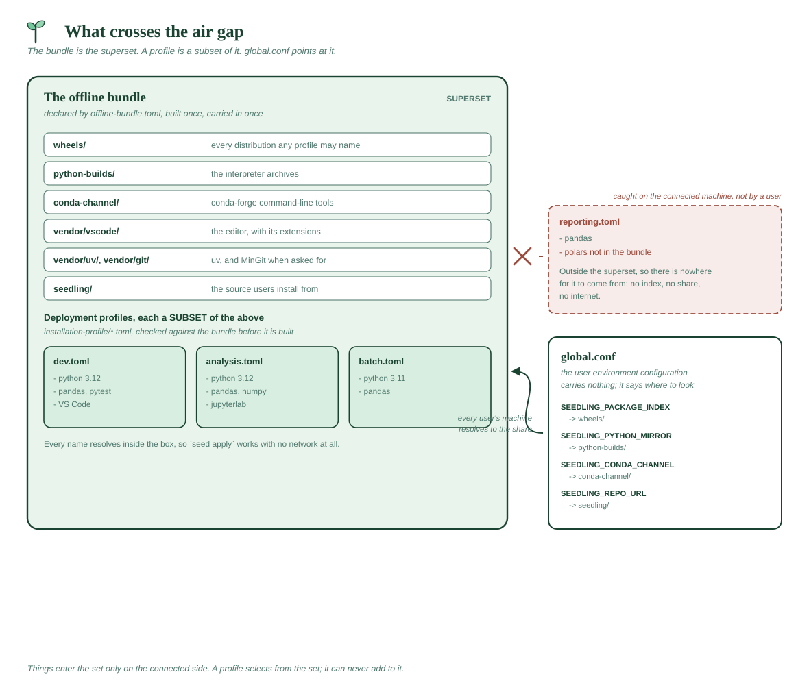

# Deployment profiles

**One file that says what environment your users should end up with.** The
admin writes it, distributes it with seedling, and every user gets the same
interpreters, venvs, packages and repos from the single command they already
run. Later, when the standard changes, they re-run `seed apply` and pick up
the difference.

`global.conf` says *where seedling gets things from*. A profile says *what
to set up once seedling works*. They are separate files because they answer
separate questions and are read at different times.

On an air-gapped network a third file joins them:
[`offline-bundle.toml`](OFFLINE.md#offline-bundletoml--what-the-share-contains)
says *what the share contains* — the superset every profile is validated
against, both when the bundle is built and later, from inside, with
[`seed profile-check`](commands/status.md#seed-profile-check-profile---bundle-path).

A third, optional file — [**custom commands**](CUSTOM-COMMANDS.md) — lets
you add your own verbs to `seed` itself (`seed lint`, `seed reset`, ...).
See it in use in the [software team](profile-examples/software-team.md) and
[classroom](profile-examples/classroom.md) examples.

---

## Contents

- [A complete example](#a-complete-example)
- [Installing with your own profile](#installing-with-your-own-profile)
- [Distributing it](#distributing-it)
- [Applying it later](#applying-it-later)
- [What apply will and won't do](#what-apply-will-and-wont-do)
- [Reference](#reference)
- [Offline bundles](#offline-bundles)

---

## A complete example

> Looking for a profile for *your* situation — a research group, a software
> team, a classroom, an air-gapped fleet? See
> **[profile examples](PROFILE-EXAMPLES.md)**, which gives a whole working
> file for each. The one below walks through the syntax key by key.

```toml
# profile.toml -- the standard environment for the data team.
schema = 1

# Interpreters to install. Omit to use whatever `seed python` picks.
python = ["3.12"]

# conda-forge command-line tools to install (the non-Python ones). Must sit
# up here with the other top-level keys, BEFORE the first [[table]] -- a TOML
# key placed after a table belongs to that table, not the profile.
tools = ["ripgrep", "pandoc"]

# Which bundled editor(s) everyone gets: "vscode" (VS Code / VSCodium) and/or
# "spyder". A bare string or a list, whichever reads better. Omit it and
# `seed apply` installs none -- whether VS Code is set up at install time
# then stays SEEDLING_AUTO_VSCODE's decision.
editor = "spyder"
# editor = ["vscode", "spyder"]   # a mixed team

[[venv]]
name = "dev"
packages = ["ipython", "ruff", "requests"]
default = true              # the venv new shells auto-activate

[[venv]]
name = "analysis"
python = "312"              # pin to a specific base; optional
packages = ["pandas", "numpy", "jupyterlab"]
default_packages = false    # skip venv_default_packages for this one

[[repo]]
url = "https://git.corp/data-team/toolkit.git"
install = "dev"             # editable-install it into the dev venv
# install = ["dev", "analysis"]        # ...or into several
# install = ["dev[gui]", "analysis"]   # ...with extras, per venv
# leave install out to clone without installing

[config]
vscode_extensions = ["ms-python.python", "charliermarsh.ruff"]
```

Everything is optional. A profile with one `[[venv]]` is a perfectly good
profile.

---

## Installing with your own profile

You don't need to distribute a modified copy of seedling to use a profile.
Point the ordinary one-line installer at a file with the `SEEDLING_PROFILE`
environment variable — this is how an admin can email or publish a single
`.toml` and have people install straight from the public one-liner:

**macOS / Linux:**
```sh
curl -fsSL https://raw.githubusercontent.com/jrvannucci/seedling/main/installers/install.sh \
  | SEEDLING_PROFILE=./team.toml sh
```

**Windows (PowerShell):**
```powershell
$env:SEEDLING_PROFILE = "C:\Users\me\Downloads\team.toml"
irm https://raw.githubusercontent.com/jrvannucci/seedling/main/installers/install.ps1 | iex
```

Relative paths resolve against the directory you ran the installer from.

Two things happen that are worth knowing:

- **The file is copied into `~/seedling/system/config/profile.toml`.** The
  original might be a downloads folder, a temp file or a mounted share, and
  `seed apply` has to keep working long after that goes away — the same
  reason seedling copies its own source in.
- **A path that doesn't exist stops the install.** This is deliberately
  unlike the [distributed](#distributing-it) case, which warns and falls back
  to the default setup: if you explicitly named a profile and silently got a
  plain environment instead, you wouldn't find out until something you
  expected was missing.

The environment variable wins over any `SEEDLING_PROFILE` in `global.conf`,
matching how `SEEDLING_REPO` and `SEEDLING_HOME` already override their conf
equivalents for one run.

---

## Who gets which profile

A fleet rarely wants one environment for everyone. Each profile says who it
reaches, in its own `[distribution]` table, and the folder holds the lot:

```toml
# installation-profile/profile.toml -- the baseline
[distribution]
default = true          # everyone gets this
```

```toml
# installation-profile/analysis.toml -- opt-in
[distribution]
users = ["alice", "priya", "sam"]
```

Point `SEEDLING_PROFILE` at the **folder** rather than a file:

```
SEEDLING_PROFILE="installation-profile"
```

`seed apply` then resolves the set for whoever is running it: the default
first, then each opt-in profile they're listed in, applied in that order —
the default establishes the baseline, an opt-in profile layers on top of it.

- **Exactly one** profile should set `default = true`; it is what every
  machine gets.
- `default` and `users` together are rejected: a profile is either everyone's
  or opt-in, not both.
- A profile with **no** `[distribution]` reaches nobody automatically. It
  exists to be applied by path (`seed apply ./scratch.toml`), which is what
  you want for one-off or experimental environments.
- Matching is **case-insensitive**, against the same login name the `{user}`
  token in `SEEDLING_HOME_DIR` expands to — so a shared-root deployment and a
  user list can't disagree about who someone is.
- A single file still works if you only ever ship one profile.

Each profile in the folder is validated against the
[offline bundle](OFFLINE.md) when the bundle is built, so an opt-in profile
for three people is checked as thoroughly as the default.

---

## Distributing it

Put the file in the copy of seedling you distribute and name it in
[`global.conf`](https://github.com/jrvannucci/seedling/blob/main/GET_STARTED/global.conf):

```
SEEDLING_PROFILE="installation-profile"
```

That is the whole handoff. Your users run the same `install.cmd` they would
have anyway, and the installer applies the profile as part of setup — no
extra step, no flags, nothing to explain.

When a profile is set it **replaces** the built-in default setup (a single
`dev` venv), rather than layering on top of it. Otherwise every machine would
carry a `dev` venv you never asked for alongside the ones you declared.

The profile is copied into `~/seedling/system/src` along with the rest of the
source, so `seed apply` keeps working after the share it was installed from
is unmounted, and `seed update-commands` refreshes it.

> If the conf names a profile that isn't there, the installer warns and falls
> back to the default setup rather than failing. A missing profile shouldn't
> brick a fleet's installs.

---

## Applying it later

```sh
seed apply                  # everything this user is distributed
seed apply ./team.toml      # a specific file
seed apply --preview        # show what would change, do nothing
seed apply --force          # also add missing packages to existing venvs
```

This is what makes a profile a *fleet-management* tool rather than a one-shot
installer input. Add a package, publish the updated profile, tell people to
run `seed apply` — only the difference is acted on, and running it twice
changes nothing the second time.

`seed apply --preview` prints the plan and exits. Use it before rolling a
change out to anyone.

---

## What apply will and won't do

**It will** install missing interpreters, create missing venvs with their
packages, clone missing repos, install the conda-forge tools and the editor
you named, and write the settings you declared.

**Everything is create-if-missing**, with one exception (`[config]`, below).
What that means per declaration, when the thing is already there:

| Declaration | Already present → |
|---|---|
| `python` | skipped |
| `[[venv]]` | left exactly as it is — never recreated, never deleted |
| `[[venv]] packages` | **not touched** without `--force`; with it, only the profile's *missing* packages are installed |
| `[[repo]]` | the clone is skipped if the directory exists — **no pull**. The install is redone for any target venv that doesn't have it |
| `tools` | skipped if that tool is already installed |
| `editor` | skipped if that editor is already installed |
| `[config]` / `default` venv | **overwritten** whenever the current value differs from the profile |

**Nothing is ever deleted or recreated.** An existing venv is left alone even
if its packages have drifted — someone may need what they added. `--force`
closes the gap in one direction only: it adds what's missing, never removes.
Getting rid of something is `seed remove-venv`, run deliberately by a person.

**A clone is never pulled**, only cloned when absent. If upstream moved and
the fleet needs the new commit, that's `git pull` in the repo, not a profile
change. The *install*, though, follows the venv rather than the clone: a repo
is installed into any venv `install` names that doesn't already have it, so a
venv rebuilt after `seed remove-venv` comes back with the repo in it.

> Whether a venv "already has it" is answered by looking for the repo's own
> distribution (the `[project] name` in its `pyproject.toml`). A repo with
> only a `requirements.txt` installs no distribution of its own, so those are
> installed when the venv is new and otherwise left until `--force`. Same
> reason adding an *extra* to a repo a venv already has needs `--force`:
> extras don't change the distribution's name.

**Settings are the one thing converged rather than filled in.** A key in
`[config]`, and the `default` venv, are written whenever the machine's current
value differs — that's how you change a fleet's default venv or VS Code flavor
after the fact. Settings the profile doesn't mention are left alone.

**Partial application is reported as failure.** If a step fails, `seed apply`
exits non-zero and names what didn't finish, because a half-applied profile
means the machine isn't what you specified. Re-running is safe: what already
succeeded is skipped.

Exit codes: `0` applied (or already current), `1` a step failed, `2` the
profile itself is invalid.

---

## Reference

| Key | Type | Meaning |
|---|---|---|
| `schema` | int | Profile format version. Currently `1`. |
| `python` | list | Interpreter versions to install, e.g. `["3.12"]`. |
| `[[venv]] name` | string | **Required.** Venv name. |
| `[[venv]] python` | string | Base tag to build from, e.g. `"312"`. Defaults to the default base. |
| `[[venv]] packages` | list | Packages for this venv. Specifiers like `"ruff>=0.5"` are fine. |
| `[[venv]] default` | bool | Make this the venv new shells auto-activate. At most one. |
| `[[venv]] default_packages` | bool | `false` skips `venv_default_packages` for this venv. |
| `tools` | list | conda-forge command-line tools to install (e.g. `["ripgrep", "pandoc=3.2"]`). Top-level key — put it before any `[[table]]`. |
| `editor` | string or list | The bundled editor(s) this deployment standardizes on: `"vscode"` and/or `"spyder"`. A bare string is treated as a one-element list. Installed by `seed apply` last, in the order given, since they're the largest downloads. Any value that isn't a bundled editor stops the whole profile rather than deploying part of it. Omit for no editor. Top-level key. |
| `[[repo]] url` | string | **Required.** Git URL to clone. |
| `[[repo]] install` | string or list | The venv(s) to install the repo into after cloning (`uv pip install -e`, or its `requirements.txt`), in the order given. Every name must be a venv this profile declares. A name may carry extras — `"dev[gui,test]"` — which apply only to that venv, so one clone can land with different optional dependencies in each. Leave the key out to clone without installing — `true` and `false` are **not** accepted: a profile either says where the repo goes or doesn't ask for it. |
| `[distribution] default` | bool | `true` distributes this profile to **everyone**. At most one profile in a folder. |
| `[distribution] users` | list | Login names this profile is distributed to, matched case-insensitively. Mutually exclusive with `default`. A profile with neither reaches nobody automatically. |
| `[config]` | table | Settings to write. See below. |

`[config]` accepts only settings that make sense per-user and after install:
`default_base`, `default_venv`, `venv_default_packages`, `vscode_flavor`,
`extension_gallery`, `vscode_extensions`.

Install-time settings — `update_source`, `package_index`, `python_mirror`,
`native_tls`, `ca_cert` — deliberately **cannot** be set from a profile. They
must be correct *before* seed-cli runs, so `global.conf` owns them; letting
a profile rewrite them would create two sources of truth for one value.

**Validation is strict.** An unknown key, a duplicate venv name, two default
venvs, or a `default_venv` — or a `[[repo]] install` — naming a venv the
profile doesn't declare all reject the whole file with a message naming the
problem. A profile goes to a
whole fleet: a typo should fail once for you, not quietly for each user.

---

## Offline bundles




[`offline-bundle.toml`](OFFLINE.md#offline-bundletoml--what-the-share-contains)
declares the superset on its own, and a profile is *validated* against it,
never folded into it. Every profile in `installation-profile/` is checked when
the bundle is built — before anything downloads, and again against what
actually landed — and
[`seed profile-check`](commands/status.md#seed-profile-check-profile---bundle-path)
from inside the air gap afterwards. A profile naming a package the share
doesn't carry is an error you see on the connected machine, not a failed
install in a locked room.

A profile never adds to the bundle. The spec lists what the share holds —
including everything the profiles need — and the build refuses a profile that
asks for more. That direction is the whole point: a superset that grew to fit
whatever a profile asked could never answer "will this work here?"

Either way, on the target `seed apply` installs the profile's tools from the
bundle, with no internet and no separate folder to carry, and the preflight
check verifies the wheel side before the bundle leaves.
