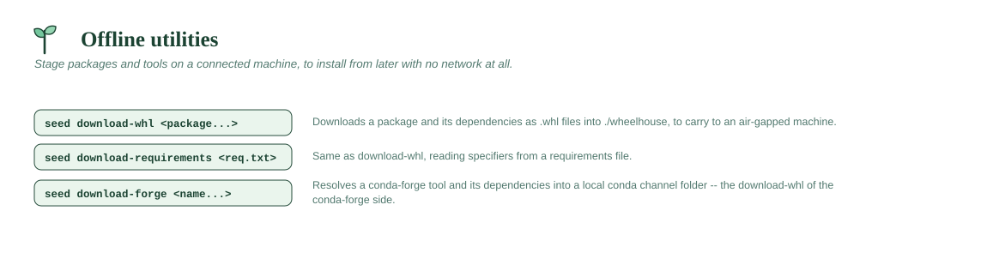

# Offline utilities



## `seed download-forge <name>[=version]... [--dest <dir>]`

The conda-forge counterpart of `download-whl`: on a connected machine, resolve
a tool **and all its dependencies** and write them into a local **conda
channel** — a directory you carry to an air-gapped machine (or a share) and
install from offline.

```
(connected)  seed download-forge ripgrep pandoc
(copy the ./conda-channel folder to the offline machine or a share)
(offline)    seed config set conda_channel <that-folder>
             seed forge-install ripgrep
```

seedling solves the request with micromamba, downloads each package
(checksum-verified), and synthesizes the channel's `repodata.json` from the
solve — so no `conda index` or network is needed on the offline side. When
`conda_channel` points at a local folder, `forge-install` runs fully offline
automatically.

Lands in `./conda-channel` unless you pass `--dest`. Pin versions with `=`
(`seed download-forge pandoc=3.2`).

## `seed download-whl <package...>`

Downloads a package **and all of its dependencies** as `.whl` files (plus any
source archives) into a flat folder — the offline-bundle builder. Run it on a
connected machine, carry the folder to an air-gapped one, and point
`package_index` at it:

```
seed download-whl pandas
# ... copy ./wheelhouse to the offline machine or a share ...
seed config set package_index /path/to/wheelhouse
seed install pandas
```

Wheels land in `./wheelhouse` unless you pass your own `--dest`. Under the hood
it runs `uvx pip download` (uv has no `pip download` of its own, so `pip` runs
as an ephemeral uv tool — nothing is installed permanently), so **every
`pip download` flag passes straight through**. That makes cross-platform
bundles easy — build wheels for a machine you're not sitting at:

```
seed download-whl numpy --only-binary=:all: \
    --platform manylinux2014_x86_64 --python-version 312 --dest ./linux-wheels
```

If `package_index` (an Artifactory/Nexus/devpi URL, or a wheels directory) or
`ca_cert` are configured, they're applied automatically as `--index-url` /
`--find-links --no-index` / `--cert`, so a bundle can itself be built from an
internal index without setting any environment variables.

## `seed download-requirements <requirements.txt>`

Same as `download-whl`, but reads package specifiers from a `requirements.txt`
(forwarded to `pip download -r`). Everything else — default `./wheelhouse`
destination, flag passthrough, `package_index`/`ca_cert` handling — is identical.

```
seed download-requirements requirements.txt
seed download-requirements requirements.txt --dest ./bundle --python-version 311
```
