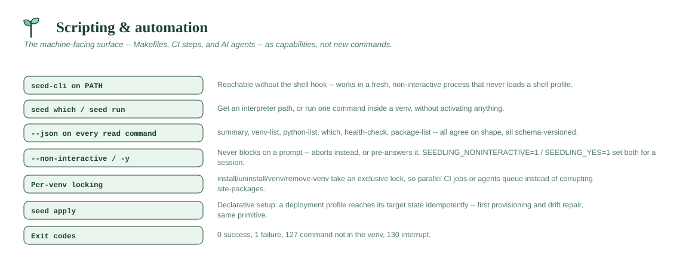

# Scripting & automation

Most of seedling is written for a person at a terminal. This is the subset
written for everything else — Makefiles, CI steps, provisioning scripts, and
AI coding agents — collected in one place because that audience arrives
looking for it, not for a particular noun.



**Find `seed` without a profile.** `seed` is a shell function (bash/zsh/
PowerShell), defined by dot-sourcing the hook install.sh/install.ps1 add to
your shell profile — which a script, CI job, or an AI agent's shell tool
often doesn't load (many spawn a fresh, non-interactive process that skips
`$PROFILE`/`.bashrc` entirely). The install also adds `system/bin` (holding
`seed-cli`, `uv`, and `micromamba`) to your **persistent user PATH**, so
`seed-cli` — the same program the function calls, just without its
shell-mutating extras (see below) — is a bare command everywhere, profile
or not. A fresh terminal or process picks it up automatically; something
already running when you installed needs a restart to see it, the same as
any other CLI tool's installer. An existing install that predates this adds
it on the next `seed update-commands`, no reinstall needed. `seed purge`
removes this PATH entry along with everything else.

**Get an interpreter without a shell.** `seed activate` mutates the calling
shell, which is useless to a caller that gets a fresh process each time. Use
[`seed which`](venvs-and-packages.md#seed-which-name---json) to resolve the interpreter, or
[`seed run`](venvs-and-packages.md#seed-run--n-venv----command-args) to execute in the venv
directly:

```sh
"$(seed which myproject)" -m mytool     # explicit interpreter
seed run -n myproject -- pytest -q      # or let seed set up the env
```

`seed run` passes the child's exit code through verbatim and leaves its
stdout and stderr byte-exact — the child writes to the real file
descriptors, so its output never passes through seedling's logging tee.

**Install into a specific venv without activating it.** `seed install` (and
`uninstall`/`package-list`/`show`) reads `VIRTUAL_ENV` from its own
environment rather than taking a venv name — there's no `-n` flag on the
passthrough commands themselves. Nest the call inside `seed run` instead:
it sets `VIRTUAL_ENV` for the child process, and a nested `seed install`
inherits it, so the package lands in exactly the venv you named:

```sh
seed run -n myproject -- seed install requests
```

**Read state as data.** `--json` is available on every read command, and the
shapes agree with each other:

| Command | Payload |
|---|---|
| `seed summary --json` | everything: tooling, interpreters, venvs, repos, settings |
| `seed venv-list --json` | the `venvs` array, identical to summary's |
| `seed python-list --json` | the `pythons` array, identical to summary's |
| `seed which <name> --json` | one venv, plus which rule resolved it |
| `seed health-check --json` | every check as `{status, area, detail}` |
| `seed package-list --json` | uv's own `pip list --format json`, unwrapped |

Every payload carries a `schema` integer. It bumps only when a field
**changes meaning or is removed** — never when one is added — so pinning to
a schema version is safe.

**Never block on a prompt.** `--non-interactive` makes a command that would
ask a question abort instead of waiting, and `-y`/`--yes` pre-answers it.
`SEEDLING_NONINTERACTIVE=1` and `SEEDLING_YES=1` set the same two things for
a whole session, which is usually what you want in CI:

```sh
export SEEDLING_NONINTERACTIVE=1
export SEEDLING_YES=1
```

Without `-y`, a `--non-interactive` command that needs confirmation exits
non-zero and says so — it never guesses.

**Concurrency is handled.** Commands that mutate a venv (`install`,
`uninstall`, `venv`, `remove-venv`) take an exclusive lock on that venv for
the duration, so parallel CI jobs or several agents on one machine queue
instead of corrupting a shared `site-packages`. Locks are per-venv, so
unrelated environments never wait on each other; a command that waits says
so on stderr, and one that waits too long fails rather than proceeding
unsafely. See [DESIGN.md](../DESIGN.md#concurrent-commands).

**Set up an environment declaratively.** A [deployment
profile](../PROFILES.md) lists the interpreters, venvs, packages and repos a
machine should end up with, and `seed apply` reaches that state
idempotently — the right primitive for provisioning a fresh machine or
bringing a stale one back in line.

**Exit codes.** `0` success, `1` failure, `127` from `seed run` when the
command isn't in the venv, `130` on interrupt. `seed health-check` exits `1`
when any check FAILs (warnings don't count).
