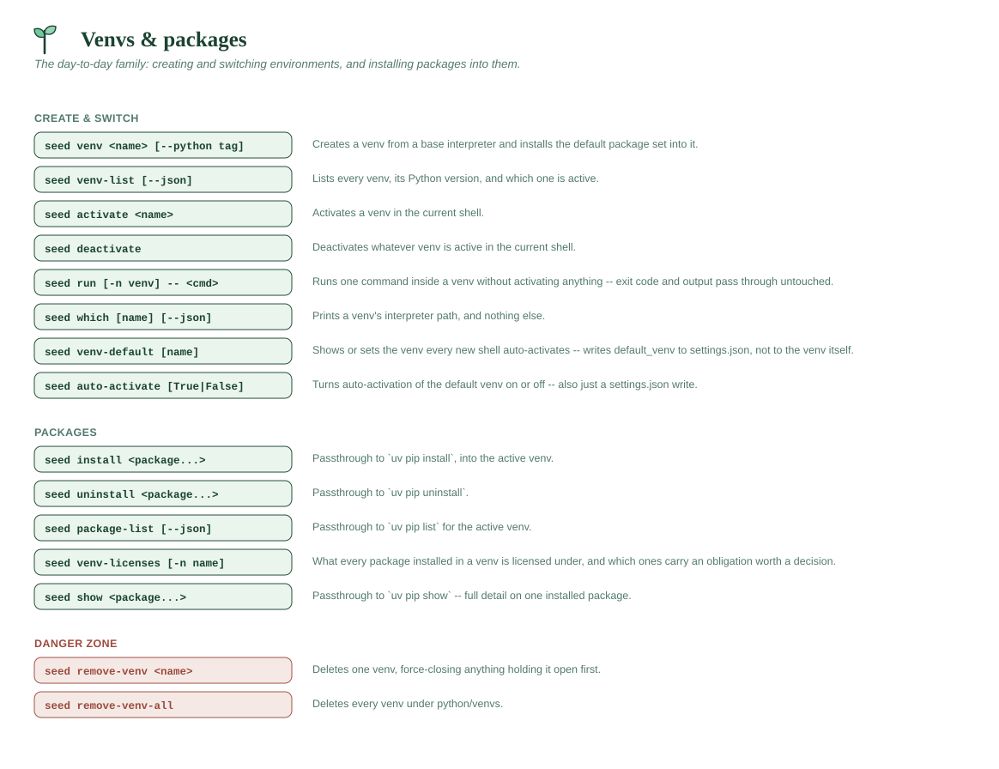

# Venvs & packages

The day-to-day family: creating and switching environments, and installing
packages into them.



## `seed venv <name> [--python <tag>] [--no-default-packages]`

Creates a virtual environment at `~/seedling/python/venvs/<name>` via
`uv venv --python <interpreter>`, then installs the default packages
(`ipython`, `ruff`, and `ipykernel`, unless changed via
`seed config set venv_default_packages ...`) into it.

- `--python <tag>` selects which installed base Python to build from
  (matching a tag from `seed python`). If omitted, uses the default base
  (the first one installed).
- `--no-default-packages` (alias `--bare`) skips the default package
  install for just this venv. If the package install fails (e.g. offline),
  the venv itself is still created and usable.
- Fails with a clear message if the requested base isn't installed, or if
  a venv with that name already exists.
- uv's own output is shown as-is (interpreter resolution, creation
  confirmation) *except* for its "activate with: source .../activate" hint,
  which is filtered out -- that's not how `seed activate` actually works
  (it's a shell function, not a sourced script path), so showing it would
  just be confusing. seedling prints its own `seed activate <name>`
  instruction instead.

```
seed venv myproject
seed venv myproject --python 311
```

## `seed venv-list [--json]`

Lists every venv under `~/seedling/python/venvs`, showing the Python
version each was created with (read straight from its `pyvenv.cfg`) and
marking whichever one matches the current `VIRTUAL_ENV` (i.e. the one
you're actually inside right now) as active.

```
seed venv-list
```
```
Venvs in ~/seedling/python/venvs:
  myproject  [python 3.12.4]  (active)
  scratch    [python 3.11.9]
```

`--json` emits the same venvs as data, with the `python_executable` path for
each. The payload is byte-identical to the `venvs` array in `seed summary
--json` — one definition of "a venv, as data", so a consumer never has to
learn two shapes.

## `seed activate <name>`

Activates a venv **in your current shell** (see
[Why `seed` is a shell function](../GUIDE.md#why-seed-is-a-shell-function)). Resolves
the right activation script per OS/shell:
- POSIX: `<venv>/bin/activate`
- Windows: `<venv>/Scripts/Activate.ps1` (falls back to `activate.bat`)

```
seed activate myproject
```

## `seed deactivate`

Deactivates whatever venv is currently active in your shell, by invoking
the `deactivate` function/command that the venv's own activation script
defined. Prints a message instead of erroring if nothing is active.

```
seed deactivate
```

## `seed run [-n <venv>] -- <command> [args...]`

Runs one command inside a venv **without activating anything**. This is the
non-interactive sibling of `seed activate`: a Makefile recipe, a CI step and
an AI agent each get a fresh process per command and have no shell to
mutate, so `activate` can't help them.

```
seed run -- python -V
seed run -n myproject -- pytest -q
```

Which venv it uses, most specific first:

1. `-n/--venv <name>`, when you say outright. A name that doesn't resolve is
   an error — never a silent fallback to a different environment.
2. `VIRTUAL_ENV` — the venv active in this shell, the same one `seed
   install` would install into.
3. `default_venv`.

Inside the child it makes exactly the three changes an activate script
makes: sets `VIRTUAL_ENV`, prepends the venv's `bin`/`Scripts` to `PATH`,
and clears `PYTHONHOME`. It is a launcher, not a sandbox — the command has
every bit of reach you do.

The command name is resolved **in the venv**, so `seed run -- python` is the
venv's python and `seed run -- pytest` is the venv's pytest. (This is worth
stating because it doesn't come free: on Windows, `CreateProcess` resolves a
bare command name against the *calling* process's `PATH`, so a naive
implementation sets the environment up correctly and then runs the system
copy inside it.)

Three guarantees worth relying on:

- **The command's exit code is yours, verbatim.** `seed run -- pytest`
  returns what pytest returned.
- **stdout and stderr are the command's, untouched.** The child writes to
  the real file descriptors, so its output does not pass through seedling's
  logging tee and stays byte-exact and pipeable. The invocation is logged;
  the child's output is not, deliberately.
- **It's argv, not a shell.** No pipes, redirection, or glob expansion. Put
  the command after `--` if it starts with a dash. For shell semantics, ask
  for them explicitly: `seed run -- sh -c '...'`.

A command that isn't installed in that venv exits **127**, matching shell
convention.

## `seed which [name] [--json]`

Prints the absolute path to a venv's Python interpreter — and nothing else,
so `$(seed which myproject)` works. Same resolution order as `seed run`.

```
seed which
```
```
/home/you/seedling/python/venvs/myproject/bin/python
```

**stdout carries the path and only the path.** Every diagnostic goes to
stderr, and a venv that can't be resolved is a non-zero exit rather than a
message where a path should be. `--json` adds the surrounding facts:

```
seed which myproject --json
```
```json
{
  "schema": 1,
  "found": true,
  "name": "myproject",
  "path": "/home/you/seedling/python/venvs/myproject",
  "python_executable": "/home/you/seedling/python/venvs/myproject/bin/python",
  "bin_dir": "/home/you/seedling/python/venvs/myproject/bin",
  "source": "argument"
}
```

`source` is which rule answered — `argument`, `VIRTUAL_ENV`, or
`default_venv`. Under `--json` a failure is also JSON (`"found": false` with
an `error`), so a consumer that always parses stdout never has to special-case
it. The exit code is still 1.

Scope is venvs only. For base interpreters, apps, tools or anything else,
`seed summary --json` already answers the broader question.

## `seed venv-default [name]`

Shows or sets the venv every **new** shell auto-activates on startup —
sugar for `seed config get/set default_venv`, promoted to its own command
because it's the setting people actually reach for. The installer's
default-environment setup points this at `dev`; switching it to your real
project is a natural next step.

- With a name: validates the venv exists, then sets it. Existing shells
  are unaffected — open a new terminal (or `seed activate <name>`).
- With no name: prints the current default (or that none is set).
- Clear it with `seed config unset default_venv` — new shells then start
  with no venv active.

```
seed venv-default
seed venv-default myproject
```

## `seed auto-activate [True|False]`

Turns **auto-activation of the default venv in new shells** on or off. This
is separate from *which* venv is the default (`seed venv-default`): it decides
*whether* that venv activates automatically when you open a terminal.

- With `True` / `False` (case-insensitive): sets it. Existing shells are
  unaffected — open a new terminal to see the change.
- With no argument: shows the current state.
- Turning it off **leaves `default_venv` set** — `seed activate` still works,
  and turning it back on resumes activating the same venv.

Sugar for the `auto_activate` setting (`seed config set auto_activate
true|false`); on by default. The shell hook honours it without launching
seed-cli — it detects the disabled state with a plain `grep` of
`settings.json`, which also lets it skip the startup seed-cli call entirely
when auto-activation is off.

```
seed auto-activate            # show current state
seed auto-activate False      # stop auto-activating in new terminals
seed auto-activate True       # resume
```

## `seed install <package...>`

Direct passthrough to `uv pip install <package...>` — everything after
`install` is forwarded untouched (flags, version pins, multiple packages,
`-U`/`--upgrade`, an editable `-e .`, etc. all work exactly as they would
with `uv pip install` directly), including flags given as the very first
argument.

Prints a warning first (but still proceeds) if `VIRTUAL_ENV` isn't set in
the environment, since `uv pip` needs a target environment to install into.

```
seed install requests
seed install -U "django>=5,<6" pillow
seed install -e .                       # editable install of the current project
```

## `seed uninstall <package...>`

Direct passthrough to `uv pip uninstall <package...>`, with the same
argument-forwarding and `VIRTUAL_ENV` warning behavior as `seed install`.

```
seed uninstall requests
```

## `seed package-list [--json]`

Direct passthrough to `uv pip list` for the active venv. Anything after
`package-list` is forwarded to `uv pip list` untouched (e.g. `--outdated`).
Same `VIRTUAL_ENV` warning as `install`/`uninstall` — though under `--json`
that note goes to stderr, so stdout stays parseable.

`--json` is translated to uv's own `--format json`, so you don't have to
remember which layer you're talking to; the output is uv's, unwrapped. An
explicit `--format` is left alone.

```
seed package-list
```
```
Package            Version
------------------ ---------
certifi            2026.6.17
requests           2.34.2
urllib3            2.7.0
```

## `seed show <package...>`

Direct passthrough to `uv pip show <package...>` for the active venv — full
details (name, version, location, dependencies, what depends on it) for a
package that's installed, the read-only counterpart of `seed install`. Same
argument-forwarding and `VIRTUAL_ENV` warning behavior as `install`/
`uninstall`/`package-list`.

A package that **isn't** installed is `uv pip show`'s normal "not found"
case, not a seedling-level error: uv prints its own warning and `seed show`
exits with uv's own exit code (`1`) — nothing is wrapped in a second
`error: ... failed` line.

```
seed show requests
```
```
Name: requests
Version: 2.34.2
Location: ~/seedling/python/venvs/dev/Lib/site-packages
Requires: certifi, charset-normalizer, idna, urllib3
Required-by:
```

## `seed remove-venv <name> [-y] [--preview] [--non-interactive]`

Deletes a single venv from `~/seedling/python/venvs`. Force-closes
Python/VS Code processes first (see `seed kill-processes`) so a running
interpreter or open file inside the venv can't block deletion. Warns (but
doesn't block) if the target looks like the currently active venv
(`VIRTUAL_ENV` matches its path) — it'll be force-closed along with
everything else, and your shell deactivates it automatically once it's
gone (see [Why `seed` is a shell function](../GUIDE.md#why-seed-is-a-shell-function)).
Prompts for confirmation unless `-y`/`--yes`; `--preview` shows what would
be deleted without deleting it; `--non-interactive` refuses to prompt and
aborts instead — see
[Non-interactive mode & previews](../DESIGN.md#non-interactive-mode--previews).

Deletion itself uses a retrying, defensive helper shared by every
`remove-*`/`purge` command — see
[Why deletion is so defensive](../DESIGN.md#why-deletion-is-so-defensive)
for the bug this fixes and how.

```
seed remove-venv myproject
seed remove-venv myproject -y
```

## `seed remove-venv-all [-y] [--preview] [--non-interactive]`

Deletes **every** venv under `~/seedling/python/venvs`, with the same
process-closing behavior as `seed remove-venv`. Lists them all before
asking for confirmation (skippable with `-y`); `--preview` lists them and
exits without deleting; `--non-interactive` refuses to prompt and aborts
instead — see
[Non-interactive mode & previews](../DESIGN.md#non-interactive-mode--previews).

```
seed remove-venv-all
```
