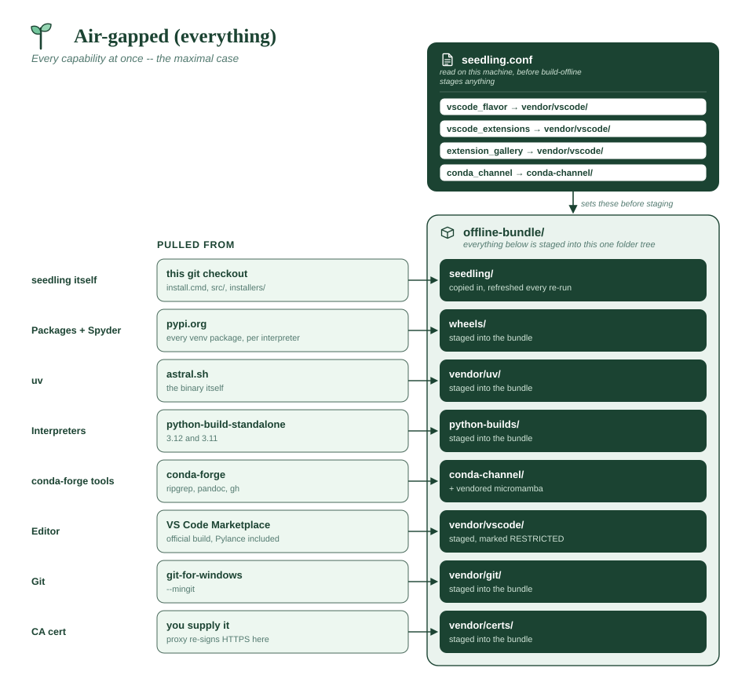
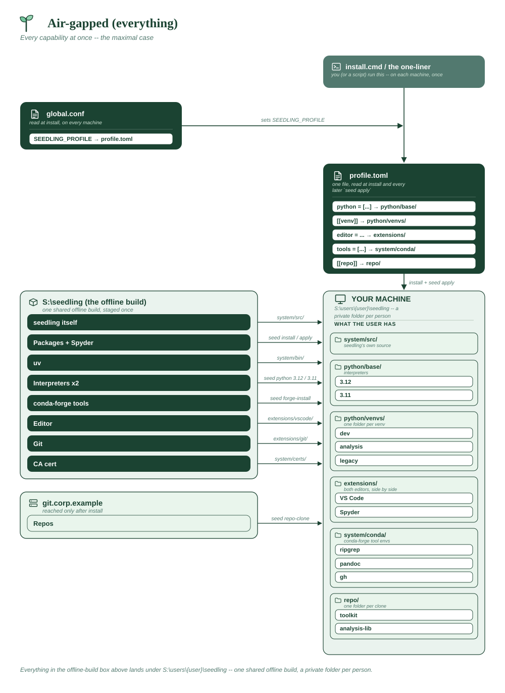

# Air-gapped (everything)

A disconnected multi-user site that wants the lot: both editors, conda-forge
tools, several interpreters, cloned repos, a corporate CA, and no internet
anywhere. This is the maximal case — most deployments need a fraction of it,
so read it as a menu rather than a template.

Three files do the work. **The profile** describes the environment:

**Assumes**

| Needs | ? | Detail |
|---|:-:|---|
| Internet on the machines | ❌ | **none** anywhere; one connected build machine, once |
| Internal package index | ✅ | a *directory* of wheels on the share |
| Official VS Code + Marketplace | ✅ | rights held; Pylance included |
| Spyder (from PyPI) | ✅ | from the bundled wheels (`--packages spyder`) |
| conda-forge tools | ✅ | `ripgrep`, `pandoc`, `gh` |
| Corporate CA certificate | ✅ | **required** -- a proxy re-signs HTTPS on this network |
| Bundled git (MinGit) | ✅ | `--mingit`, for Windows targets with no git |
| A reachable git host | ✅ | internal host, reachable from the target network |
| Multi-user share root | ✅ | `S:\users\{user}\seedling`, enabling the `admin-*` commands |
| Offline bundle to build | ✅ | the full build, every flag |
| **x86_64 only** | ✅ | the Spyder half pins the whole profile to x86_64 |





```toml
# profile.toml -- the standard environment, applied at install and
# re-applied with `seed apply` whenever this file changes.

schema = 1

# Every interpreter anyone needs. Each is mirrored into the bundle, and the
# wheel set is resolved once per interpreter, so platform/abi wheels match
# all of them.
python = ["3.12", "3.11"]

# Non-Python programs, from conda-forge. Bundled as a local conda channel.
tools = ["ripgrep", "pandoc", "gh"]

# Both editors: engineers open VS Code, analysts open Spyder.
editor = ["vscode", "spyder"]

# --- environments ---------------------------------------------------------

[[venv]]
name = "dev"
python = "312"
packages = ["pytest", "pytest-cov", "mypy", "ruff", "ipython"]
default = true

[[venv]]
name = "analysis"
python = "312"
packages = ["pandas", "numpy", "scipy", "matplotlib", "jupyterlab", "openpyxl"]

# Pinned to 3.11 for the service that hasn't migrated, and given nothing but
# what it lists -- no ipython/ruff/ipykernel on top.
[[venv]]
name = "legacy"
python = "311"
packages = ["requests==2.32.3", "flask==3.0.3"]
default_packages = false

# --- internal repos -------------------------------------------------------
# Cloned from the internal git host (or a share path), never the internet.

[[repo]]
url = "https://git.corp.example/platform/toolkit.git"
install = "dev"

# Each repo names the environment it belongs in, rather than following
# whichever venv happens to be the default.
[[repo]]
url = "https://git.corp.example/platform/analysis-lib.git"
install = "analysis"

# --- settings pushed to every machine -------------------------------------

[config]
# Every key a profile is allowed to set. The install-time settings -- the
# mirror, the index, TLS, the update source -- belong in global.conf
# instead: they have to be right before seed-cli runs at all.
default_base = "312"
default_venv = "dev"
venv_default_packages = ["ipython", "ruff", "ipykernel"]
vscode_flavor = "microsoft"
extension_gallery = "https://openvsx.corp.example/vscode"
vscode_extensions = [
    "ms-python.python",
    "ms-python.vscode-pylance",
    "ms-python.debugpy",
    "ms-toolsai.jupyter",
    "charliermarsh.ruff",
]
```

**`global.conf`** carries everything that must be true *before* seed-cli
exists — the share paths, TLS, and the multi-user layout:

```sh
# GET_STARTED/global.conf -- shipped in the copy on the share.

# Install from the share itself: a directory, not a git URL, so neither git
# nor a network is needed to install, or to `seed update-commands` later.
SEEDLING_REPO_URL="S:\seedling\seedling"

# One root, a private folder per person. The {user} token is also what
# enables the elevated admin-* commands for cross-user teardown.
SEEDLING_HOME_DIR="S:\users\{user}\seedling"

# The three offline sources the bundle provides.
SEEDLING_PYTHON_MIRROR="S:\seedling\python-builds"
SEEDLING_PACKAGE_INDEX="S:\seedling\wheels"
SEEDLING_CONDA_CHANNEL="S:\seedling\conda-channel"

# The editor build and extension set every INSTALLED machine gets -- decided
# here, not in the profile. These must match [editor] in offline-bundle.toml,
# which is what actually gets staged; the builder compares them and stops if
# they disagree.
SEEDLING_VSCODE_FLAVOR="microsoft"
SEEDLING_EXTENSION_GALLERY="https://openvsx.corp.example/vscode"
SEEDLING_VSCODE_EXTENSIONS="ms-python.python,ms-python.vscode-pylance,ms-python.debugpy,ms-toolsai.jupyter,charliermarsh.ruff"

# A TLS-inspecting proxy re-signs HTTPS here, so the corporate root goes in
# vendor/certs/ and the installer trusts it for uv, git and seedling's own
# downloads. Set this to "true" instead if IT installed the CA machine-wide.
SEEDLING_NATIVE_TLS="false"

# Apply the profile automatically at install.
SEEDLING_PROFILE="installation-profile/profile.toml"
```

**What the share holds**, declared once and independently of any profile.
This is the file `--check-profile` and `seed profile-check` validate against:

```toml
# offline-bundle.toml -- in GET_STARTED_OFFLINE_BUNDLE/ in the copy you distribute.

schema = 1

pythons = ["3.12", "3.11"]

# Every distribution any profile may name, plus room for what users will want
# later -- on this network nobody can add one. `spyder` is here because an
# editor named in a profile is still an ordinary PyPI application, and
# `requests`/`flask` carry the pins the legacy venv asks for.
packages = [
    "pytest", "pytest-cov", "mypy", "ruff", "ipython",
    "pandas", "numpy", "scipy", "matplotlib", "jupyterlab", "openpyxl",
    "requests==2.32.3", "flask==3.0.3",
    "spyder", "httpx", "polars",
]

tools = ["ripgrep", "pandoc", "gh"]

[editor]
flavor = "microsoft"
gallery = "https://openvsx.corp.example/vscode"
extensions = [
    "ms-python.python", "ms-python.vscode-pylance", "ms-python.debugpy",
    "ms-toolsai.jupyter", "charliermarsh.ruff",
]

[git]
mingit = true

# No [[repo]] here: the profile's repos are cloned from git.corp.example,
# which lives on the closed network and is unreachable from this build
# machine. Anything they need at install time is listed in `packages` above.
```

**Building it**, once, on a connected machine. The spec supplies the
interpreters, packages, tools and MinGit, so the only flags left are where it
lands and the licence acknowledgement:

```
GET_STARTED_OFFLINE_BUNDLE/offline-bundler.cmd
```

**What each piece buys**

| Piece | What it makes work with no internet |
|---|---|
| `python-builds/` | `seed python 3.12` — interpreters |
| `wheels/` | `seed install`, every venv's packages, **and `seed tool-install`** |
| `conda-channel/` + vendored micromamba | `seed forge-install ripgrep` |
| `vendor/vscode/` | VS Code and its extensions, pre-seeded |
| `vendor/git/` (`--mingit`) | `seed repo-clone` on Windows with no system git |
| `vendor/certs/` | HTTPS through a TLS-inspecting proxy |
| `vendor/uv/` | all of it — uv itself is bundled |

**The parts worth getting right**

- **`--packages spyder`** is what makes the Spyder half of `editor` work.
  Spyder is a PyPI application, so it resolves from `wheels/` like anything
  else — there is no separate artifact for it, but its wheels do have to be
  staged. Without this, `seed apply` reaches the Spyder step and finds
  nothing to install from.
- **`--deploy-root`** writes the bundle's `global.conf` with the paths the
  *target* will see, which are not where you built it. Get it wrong and every
  path in the shipped conf points at your build machine.
- **`extension_gallery` appears in both files on purpose.** The conf value is
  what the bundle is built against; the profile value is what lands in each
  user's settings afterwards.
- **Verify before carrying it in.** The build finishes by installing from the
  finished bundle with the network refused and a cold cache. Re-run that
  against the copy on the share to prove the transfer was complete too:

  ```
  GET_STARTED_OFFLINE_BUNDLE/offline-bundler.cmd --verify-only -o S:\seedling
  ```

- **`MANIFEST.json`** records every component, its source, its licence, and
  whether it was staged — the file to hand a security review rather than
  reconstructing the answer.

**What still needs the internet:** nothing, once the bundle is on the share.
Users install from `S:\seedling\seedling`, `seed apply` provisions entirely
from the bundled sources, and `seed update-commands` re-reads that same
directory — so updating the fleet is copying a new bundle over the old one.

**What the bundle looks like**

Everything the builder can produce, plus the one folder it can't:

```
offline-bundle/                       -> copied to S:\seedling
├── MANIFEST.json                     every component, its source and licence
├── seedling/                         users run GET_STARTED/install.cmd from here
│   ├── install.cmd                   what users actually run
│   ├── installers/                   install.ps1, install.sh
│   ├── GET_STARTED/global.conf                 the conf above, --deploy-root applied
│   ├── installation-profile/profile.toml         the profile above
│   ├── src/                          seedling's own source
│   └── vendor/
│       ├── uv/
│       │   ├── uv.exe
│       │   └── uvx.exe
│       ├── vscode/
│       │   └── app/                  official VS Code + extensions
│       │       ├── Code.exe
│       │       ├── bin/code.cmd
│       │       └── data/             settings + installed extensions
│       ├── micromamba/
│       │   └── micromamba.exe
│       ├── git/                      MinGit, from --mingit
│       │   ├── cmd/git.exe
│       │   └── mingw64/
│       └── certs/                    <- YOU fill this one
│           ├── corp-root-ca.pem
│           └── corp-issuing-ca.pem
├── python-builds/
│   └── 20250115/                     the release tag uv asked for
│       ├── cpython-3.12.8+2025...-x86_64-pc-windows-msvc-install_only.tar.gz
│       └── cpython-3.11.11+2025...-x86_64-pc-windows-msvc-install_only.tar.gz
├── wheels/                           flat, one folder, every interpreter
│   ├── hatchling-1.27.0-py3-none-any.whl
│   ├── spyder-6.1.5-py3-none-any.whl
│   ├── PyQt5-5.15.11-cp38-abi3-win_amd64.whl
│   ├── numpy-2.1.3-cp312-cp312-win_amd64.whl
│   ├── numpy-2.1.3-cp311-cp311-win_amd64.whl      <- per-interpreter
│   └── ... a few hundred more
└── conda-channel/
    ├── noarch/repodata.json
    └── win-64/
        ├── repodata.json             synthesized from the solve
        ├── ripgrep-14.1.1-h.....conda
        ├── pandoc-3.5-h.....conda
        └── gh-2.63.2-h.....conda
```

Where each lands on the target:

| Bundle folder | Installed to |
|---|---|
| `vendor/uv/` | `system/bin/` |
| `vendor/micromamba/` | `system/bin/` |
| `vendor/vscode/` | `extensions/vscode/` |
| `vendor/git/` | `extensions/git/` |
| `vendor/certs/` | concatenated into `system/certs/ca-bundle.pem` |

Note `numpy` appearing twice: the wheel set is resolved **once per mirrored
interpreter**, because compiled dependencies ship `cp312`/`cp311`-tagged
wheels. A flat folder holds every tag happily, and this is what makes
`seed venv --python 311` work offline.

**What a cert file looks like.** Any PEM-encoded certificate, one or more per
file. The installer concatenates *every* `.pem` and `.crt` in the folder into
`~/seedling/system/certs/ca-bundle.pem`, so a root and an intermediate can be
separate files:

```
vendor/certs/
├── corp-root-ca.pem
└── corp-issuing-ca.pem
```

```
-----BEGIN CERTIFICATE-----
MIIDdzCCAl+gAwIBAgIEAgAAuTANBgkqhkiG9w0BAQUFADBaMQswCQYDVQQGEwJJ
... base64, usually 20-30 lines ...
c2VkbGluZyBleGFtcGxlIC0tIG5vdCBhIHJlYWwgY2VydGlmaWNhdGU=
-----END CERTIFICATE-----
```

Export it from your browser or from IT as **Base-64 encoded X.509**, not DER.
A DER file (binary, often `.cer`) gets concatenated as bytes and quietly
breaks the bundle — if HTTPS fails after install, check this first. The bundle
is rebuilt on every install, so rotating a certificate is a re-run rather than
a manual edit.

Check what actually landed once a target is installed:

```
seed summary --json
seed health-check
```
