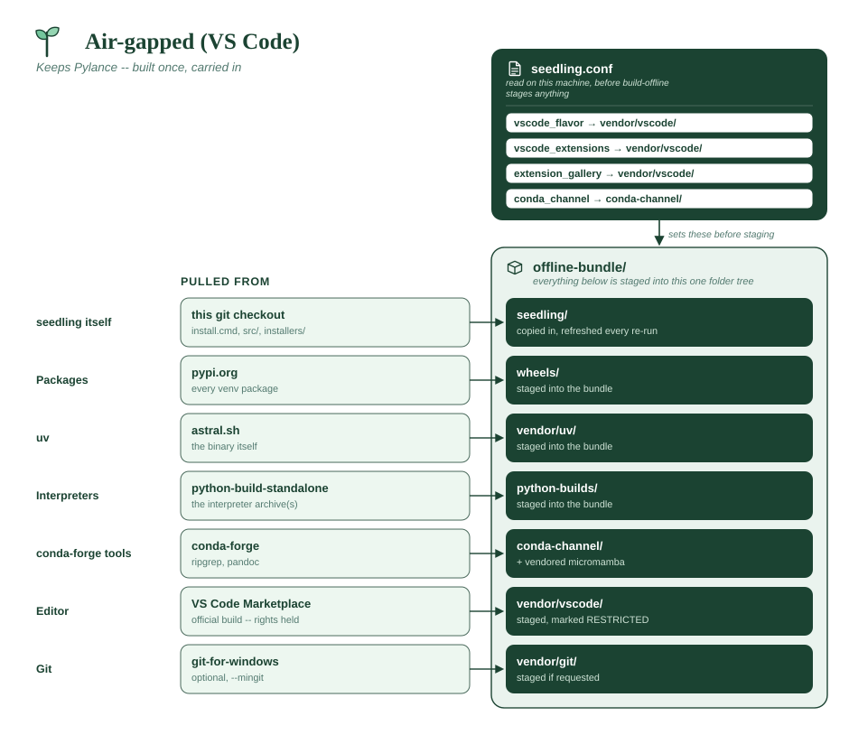
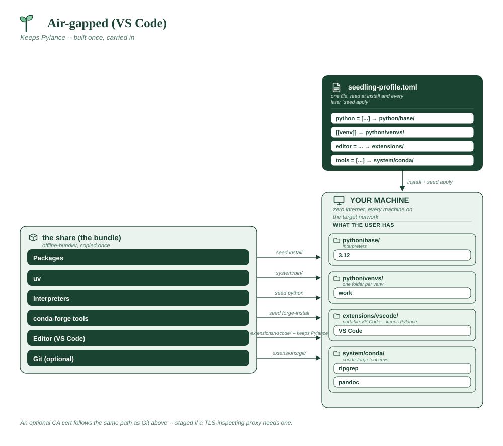

# Air-gapped (VS Code)

The same disconnected network, but this organization has the agreements in
place to redistribute the official VS Code build and Marketplace extensions
internally — so it keeps **Pylance**, and with it the type checking and
completions the openly-licensed stack can't offer.

The profile is unremarkable; the licensing decision lives in the conf.

**Assumes**

| Needs | ? | Detail |
|---|:-:|---|
| Internet on the machines | ❌ | **none** on the target network |
| Internal package index | ✅ | a *directory* of wheels on the share, not a URL |
| Official VS Code + Marketplace | ✅ | **you hold redistribution rights** -- keeps Pylance |
| Spyder (from PyPI) | ❌ | VS Code only |
| conda-forge tools | ✅ | `ripgrep`, `pandoc`, bundled as a conda channel |
| Corporate CA certificate | ⚠️ | if a proxy inspects TLS -- you supply the root |
| Bundled git (MinGit) | ⚠️ | pass `--mingit` if the targets have no git |
| A reachable git host | ❌ | no `[[repo]]` entries |
| Multi-user share root | ❌ | per-user installs from the share |
| Offline bundle to build | ✅ | built once, with `--accept-third-party-terms` |
| **x86_64 only** | ❌ | VS Code ships arm64 builds |





```toml
# profile.toml -- distributed on the share, applied at install.

python = ["3.12"]

tools = ["ripgrep", "pandoc"]

editor = "vscode"

[[venv]]
name = "work"
packages = ["pandas", "numpy", "requests", "pytest", "mypy"]
default = true
```

```sh
# global.conf, in the copy you distribute.
# "microsoft" is the default, but state it explicitly here -- this file is
# what a reviewer reads to see which build was staged.
SEEDLING_VSCODE_FLAVOR="microsoft"
SEEDLING_VSCODE_EXTENSIONS="ms-python.python,ms-python.vscode-pylance,ms-python.debugpy,ms-toolsai.jupyter,charliermarsh.ruff"
```

The share declares its own contents, and the profile is checked against them:

```toml
# offline-bundle.toml -- what the share will hold, next to global.conf.

pythons = ["3.12"]

# More than the profile needs: nobody on an isolated network can add one
# later. hatchling/ipython/ruff/ipykernel/pip are always bundled.
packages = ["pandas", "numpy", "requests", "pytest", "mypy", "httpx", "openpyxl"]

tools = ["ripgrep", "pandoc"]

[editor]
flavor = "microsoft"
extensions = [
    "ms-python.python", "ms-python.vscode-pylance", "ms-python.debugpy",
    "ms-toolsai.jupyter", "charliermarsh.ruff",
]
```

Build it with the acknowledgement, which is deliberately **not** covered by
`--yes`:

```
build-offline.cmd --check-profile profile.toml --accept-third-party-terms
```

**Why it's shaped this way**

- `ms-python.vscode-pylance` is the whole point of this variant. It is
  licensed to run only in official Microsoft products, so it belongs with
  `SEEDLING_VSCODE_FLAVOR="microsoft"` and nowhere else — pairing it with
  VSCodium gets you an extension that refuses to load.
- `--accept-third-party-terms` is required because VS Code and Marketplace
  extensions are marked **restricted**: staging them on a share is
  redistribution *you* are performing. seedling grants no rights; the flag is
  you asserting you hold them. It resists `--yes` on purpose, so an
  unattended build can't acknowledge licence terms on your behalf.
- **The extension list above reaches your users, not the bundler.** It seeds
  each machine's `vscode_extensions` at install time; what gets *staged* into
  `vendor/vscode/` is whatever the build machine's own settings say. The
  default set already includes Pylance, so this example builds correctly
  either way — but if you trim or extend the list here, set the same list on
  the builder (`seed config set vscode_extensions "..."`) or the bundle won't
  match. See [the note in OFFLINE.md](../OFFLINE.md#7-vs-code-optional).
- The bundle's `MANIFEST.json` lists every component with its licence and
  whether it was staged. That file is what to hand a security review rather
  than re-deriving the answer.
- `mypy` in the venv rather than relying on Pylance alone: Pylance checks in
  the editor, but CI and pre-commit need a checker they can run headlessly.

**What the bundle looks like**

The same shape as the previous example, with two differences: `vendor/vscode/`
holds the **official** build with Marketplace extensions (Pylance included),
and `MANIFEST.json` records those as `restricted` — which is exactly what
`--accept-third-party-terms` acknowledges.

```
offline-bundle/
├── MANIFEST.json            lists VS Code + extensions as RESTRICTED
├── seedling/
│   ├── global.conf
│   ├── offline-bundle.toml
│   ├── profile.toml
│   └── vendor/
│       ├── uv/                  uv.exe, uvx.exe
│       ├── vscode/
│       │   └── app/             official VS Code, portable
│       │       ├── Code.exe
│       │       ├── bin/code.cmd     the CLI entry point seedling drives
│       │       └── data/            portable-mode settings AND extensions,
│       │                            incl. ms-python.vscode-pylance-*
│       ├── micromamba/          micromamba.exe
│       └── certs/               <- YOU fill this one
├── python-builds/
├── wheels/
└── conda-channel/
```

Extensions live under `app/data/` rather than `~/.vscode` — that is portable
mode, and it is why `seed purge` leaves nothing behind.

**What a cert file looks like.** Any PEM-encoded certificate, one or more per
file. The installer concatenates *every* `.pem` and `.crt` in the folder into
`~/seedling/system/certs/ca-bundle.pem`, so a root and an intermediate can be
separate files:

```
vendor/certs/
├── corp-root-ca.pem
└── corp-issuing-ca.pem
```

```
-----BEGIN CERTIFICATE-----
MIIDdzCCAl+gAwIBAgIEAgAAuTANBgkqhkiG9w0BAQUFADBaMQswCQYDVQQGEwJJ
... base64, usually 20-30 lines ...
c2VkbGluZyBleGFtcGxlIC0tIG5vdCBhIHJlYWwgY2VydGlmaWNhdGU=
-----END CERTIFICATE-----
```

Export it from your browser or from IT as **Base-64 encoded X.509**, not DER.
A DER file (binary, often `.cer`) gets concatenated as bytes and quietly
breaks the bundle — if HTTPS fails after install, check this first. The bundle
is rebuilt on every install, so rotating a certificate is a re-run rather than
a manual edit.
