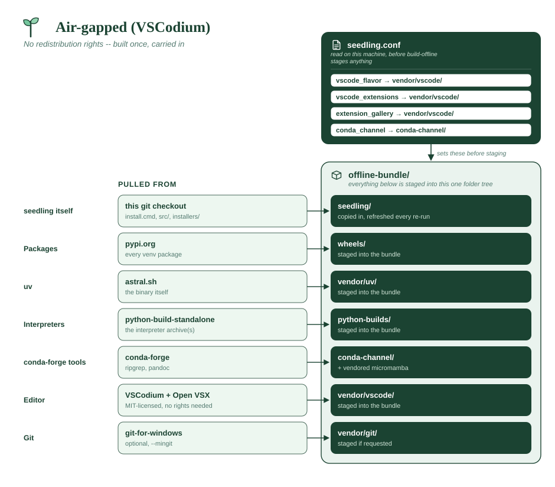
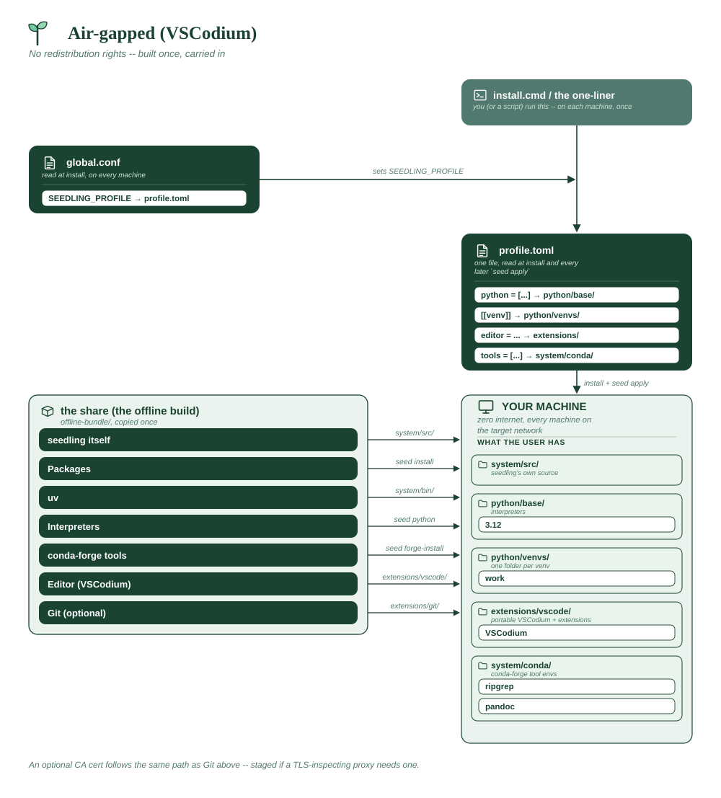

# Air-gapped (VSCodium)

A network with no internet, and a review that will ask what you redistributed.
Pairs with an [offline bundle](../OFFLINE.md).

**Assumes**

| Needs | ? | Detail |
|---|:-:|---|
| Internet on the machines | ❌ | **none** on the target network |
| Internal package index | ✅ | a *directory* of wheels on the share, not a URL |
| Official VS Code + Marketplace | ❌ | **no rights to redistribute it** -- this is the whole point |
| Spyder (from PyPI) | ❌ | VSCodium only |
| conda-forge tools | ✅ | `ripgrep`, `pandoc`, bundled as a conda channel |
| Corporate CA certificate | ⚠️ | if a proxy inspects TLS -- you supply the root |
| Bundled git (MinGit) | ⚠️ | pass `--mingit` if the targets have no git |
| A reachable git host | ❌ | no `[[repo]]` entries |
| Multi-user share root | ❌ | per-user installs from the share |
| Offline bundle to build | ✅ | built once on a connected machine |
| **x86_64 only** | ❌ | VSCodium ships arm64 builds |





```toml
# seedling-profile.toml -- distributed on the share, applied at install.

python = ["3.12"]

tools = ["ripgrep", "pandoc"]

editor = "vscode"

[[venv]]
name = "work"
packages = ["pandas", "numpy", "requests", "pytest"]
default = true
```

**Which editor build is decided in `seedling.conf`, not here.** The bundler
stages the editor *before* any profile is applied, so it reads the conf on
the build machine:

```sh
# seedling.conf, in the copy you distribute
SEEDLING_VSCODE_FLAVOR="vscodium"
SEEDLING_VSCODE_EXTENSIONS="ms-python.python,ms-toolsai.jupyter,charliermarsh.ruff"
```

**Why it's shaped this way**

- VSCodium is the licensing decision, not a preference: staging the official
  VS Code binaries on a share is redistribution under Microsoft's terms.
  It's MIT-licensed, already points at Open VSX, and needs no
  acknowledgement to bundle.
- **The tradeoff is Pylance** — proprietary, and absent from Open VSX by
  design — so the Python extension falls back to its bundled Jedi server.
  If your organization *does* hold Marketplace rights, see
  [the next example](air-gapped-vs-code.md).
- The bundler reads the *profile* for everything else, so `build-offline`
  stages wheels for every package listed and a conda channel for every tool
  — no second hand-kept list. Build it with
  `build-offline.cmd --profile seedling-profile.toml`.
- Nothing here mentions the share's paths: those live in `seedling.conf`
  (`SEEDLING_PACKAGE_INDEX` and friends), which is install-time configuration
  a profile deliberately can't override.

**What the bundle looks like**

```
offline-bundle/
├── MANIFEST.json            what was staged, and under what licence
├── seedling/                users run install.cmd from here
│   ├── seedling.conf            written with your --deploy-root paths
│   ├── seedling-profile.toml    the profile above
│   └── vendor/
│       ├── uv/                  uv.exe, uvx.exe
│       ├── vscode/              app/  (portable VSCodium + Open VSX exts)
│       ├── micromamba/          micromamba.exe
│       ├── certs/               <- YOU fill this one
│       └── git/                 only with --mingit
├── python-builds/           SEEDLING_PYTHON_MIRROR
├── wheels/                  SEEDLING_PACKAGE_INDEX
└── conda-channel/           SEEDLING_CONDA_CHANNEL
```

Where each lands on the target:

| Bundle folder | Installed to |
|---|---|
| `vendor/uv/` | `system/bin/` |
| `vendor/micromamba/` | `system/bin/` |
| `vendor/vscode/` | `extensions/vscode/` |
| `vendor/git/` | `extensions/git/` |
| `vendor/certs/` | concatenated into `system/certs/ca-bundle.pem` |

**What a cert file looks like.** Any PEM-encoded certificate, one or more per
file. The installer concatenates *every* `.pem` and `.crt` in the folder into
`~/seedling/system/certs/ca-bundle.pem`, so a root and an intermediate can be
separate files:

```
vendor/certs/
├── corp-root-ca.pem
└── corp-issuing-ca.pem
```

```
-----BEGIN CERTIFICATE-----
MIIDdzCCAl+gAwIBAgIEAgAAuTANBgkqhkiG9w0BAQUFADBaMQswCQYDVQQGEwJJ
... base64, usually 20-30 lines ...
c2VkbGluZyBleGFtcGxlIC0tIG5vdCBhIHJlYWwgY2VydGlmaWNhdGU=
-----END CERTIFICATE-----
```

Export it from your browser or from IT as **Base-64 encoded X.509**, not DER.
A DER file (binary, often `.cer`) gets concatenated as bytes and quietly
breaks the bundle — if HTTPS fails after install, check this first. The bundle
is rebuilt on every install, so rotating a certificate is a re-run rather than
a manual edit.
