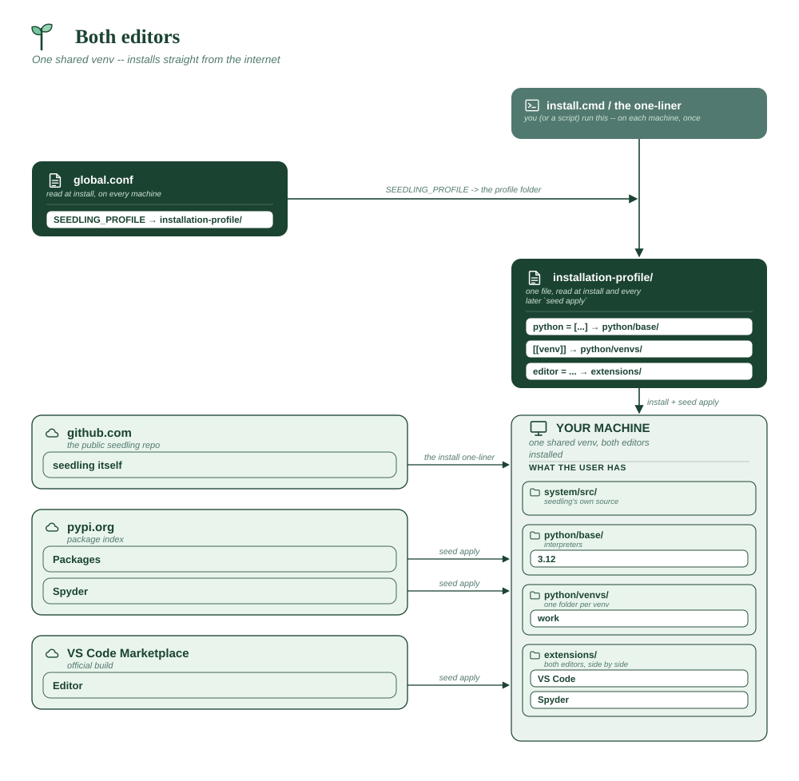

# Both editors

One department, two working styles. Both editors are installed; each person
uses whichever they open.

**Assumes**

| Needs | ? | Detail |
|---|:-:|---|
| Internet on the machines | ✅ | PyPI and the Marketplace |
| Internal package index | ❌ | public PyPI |
| Official VS Code + Marketplace | ✅ | for the VS Code half |
| Spyder (from PyPI) | ✅ | for the Spyder half |
| conda-forge tools | ❌ | none declared |
| Corporate CA certificate | ❌ | default trust store |
| Bundled git (MinGit) | ❌ | not needed |
| A reachable git host | ❌ | no `[[repo]]` entries |
| Multi-user share root | ❌ | per-user installs |
| Offline bundle to build | ❌ | installs straight from the internet |
| **x86_64 only** | ✅ | the Spyder half pins the whole profile to x86_64 |



```toml
# profile.toml -- research engineering.

python = ["3.12"]

editor = ["vscode", "spyder"]

[distribution]
# Everyone who installs from this share gets this profile. Others in
# installation-profile/ opt in by listing users instead.
default = true

[[venv]]
name = "work"
packages = ["pandas", "numpy", "matplotlib", "pytest", "ipython"]
default = true
```

**Why it's shaped this way**

- Listing both means ~500 MB of editors, so it's worth being deliberate.
  Naming VS Code among them also keeps its download running in parallel with
  the Python setup, which listing Spyder alone would skip.
- One shared venv, because the split here is about tooling preference, not
  about incompatible dependencies. Use separate venvs when the *packages*
  disagree, not when the people do.

**Vendor folder:** none. Everything downloads on demand.
