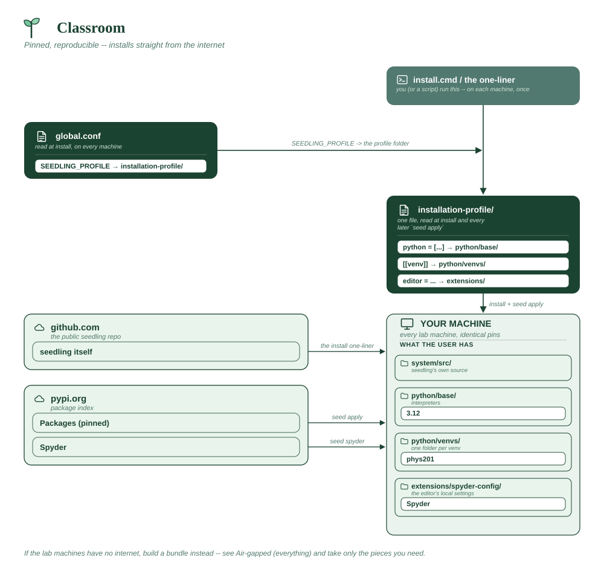

# Classroom

Thirty machines that must be identical, and a student who breaks one should
be able to rebuild it in a single command. Everything pinned, nothing
optional.

**Assumes**

| Needs | ? | Detail |
|---|:-:|---|
| Internet on the machines | ✅ | during setup at least |
| Internal package index | ❌ | public PyPI |
| Official VS Code + Marketplace | ❌ | deliberately avoided -- no accounts to manage |
| Spyder (from PyPI) | ✅ | the only editor |
| conda-forge tools | ❌ | none |
| Corporate CA certificate | ⚠️ | only if the campus proxy inspects TLS |
| Bundled git (MinGit) | ❌ | not needed |
| A reachable git host | ❌ | no `[[repo]]` entries |
| Multi-user share root | ❌ | per-user installs on lab machines |
| Offline bundle to build | ⚠️ | only if the lab machines have no internet |
| **x86_64 only** | ✅ | Spyder's Qt wheels are x86_64-only |



```toml
# profile.toml -- PHYS-201, autumn term.

python = ["3.12"]

editor = "spyder"

[[venv]]
name = "phys201"
packages = [
    "numpy==2.1.3",
    "scipy==1.14.1",
    "matplotlib==3.9.2",
    "pandas==2.2.3",
]
default = true
# Only the four pinned packages above -- not seedling's usual ipython/ruff/
# ipykernel. Everyone gets the same list, and the marker's machine matches.
default_packages = false
```

**Why it's shaped this way**

- Exact `==` pins so results reproduce in week twelve as they did in week one.
- `default_packages = false` keeps the environment to exactly what's listed.
  Note that `seed spyder` still adds `spyder-kernels` — that's required for
  its console to connect at all, not an extra.
- Rebuilding a broken machine is `seed remove-venv phys201 && seed apply` --
  or, with the [custom command](../CUSTOM-COMMANDS.md) below, `seed reset`.

**`seed reset`, so a student never has to remember the two-command recipe.**
This is the [`script` shape](../CUSTOM-COMMANDS.md#the-script-shape) rather
than `run`, because it chains two `seed` operations rather than running a
single fixed one — and `toplevel = true`
([making a command top-level](../CUSTOM-COMMANDS.md#making-a-command-top-level))
means it really is just the one word to type, not `seed custom reset`:

```toml
# custom-commands.toml -- next to profile.toml
[[command]]
name = "reset"
script = "reset.py"
description = "Rebuild the phys201 venv from scratch"
toplevel = true
```

```python
# reset.py, next to custom-commands.toml
import subprocess, sys

def main(argv):
    subprocess.run(["seed", "remove-venv", "phys201", "-y"], check=True)
    subprocess.run(["seed", "apply"], check=True)
    return 0

if __name__ == "__main__":
    sys.exit(main(sys.argv[1:]))
```

```sh
# global.conf
SEEDLING_CUSTOM_COMMANDS="custom-commands.toml"
```

No SDK, no special orchestration API — the script shells out to `seed`
itself, the same two commands from the bullet point above, just one word for
a student to type and remember: `seed reset`.

**Vendor folder:** none, assuming the lab machines have internet during setup.
If they don't, build a bundle instead — see
[Air-gapped (everything)](air-gapped-everything.md) and take only the pieces you
need.
