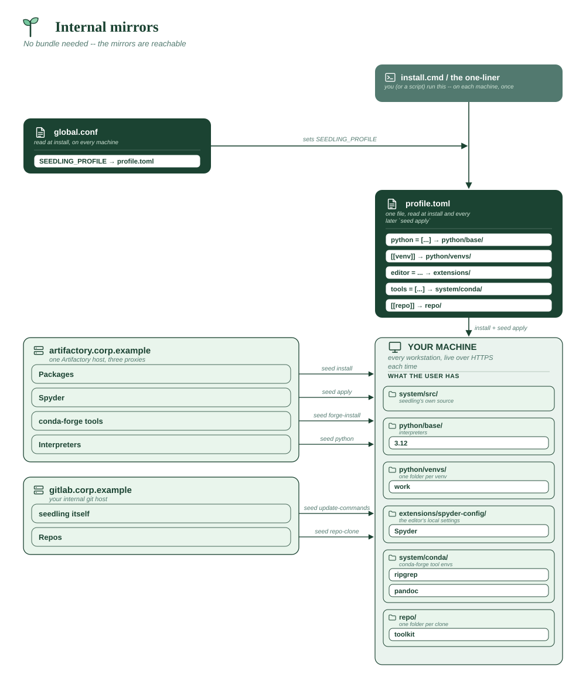

# Internal mirrors

The middle ground, and the most common enterprise shape: **no public
internet, but working internal mirrors.** An Artifactory or Nexus proxying
PyPI, a conda-forge mirror, an internal GitLab, and a TLS-inspecting proxy in
front of all of it.

This needs **no offline bundle at all** — the mirrors are reachable, so
seedling installs from them the same way it would from the public ones. It is
a different situation from an air gap, and treating it like one costs you a
build step you don't need.

**Assumes**

| Needs | ? | Detail |
|---|:-:|---|
| Internet on the machines | ❌ | no public PyPI, no Marketplace, no GitHub |
| Internal package index | ✅ | **this is the point** -- Artifactory/Nexus/devpi over HTTPS |
| Official VS Code + Marketplace | ❌ | the update API and Marketplace are blocked |
| Spyder (from PyPI) | ✅ | installs from the internal index like any other package |
| conda-forge tools | ✅ | from an internal conda-forge mirror |
| Corporate CA certificate | ✅ | **required** -- the proxy re-signs HTTPS |
| Bundled git (MinGit) | ❌ | system git, pointed at the internal host |
| A reachable git host | ✅ | internal GitHub/GitLab |
| Multi-user share root | ❌ | per-user installs |
| Offline bundle to build | ❌ | **no bundle needed** -- the mirrors are reachable |
| **x86_64 only** | ✅ | Spyder's Qt wheels are x86_64-only |



```toml
# seedling-profile.toml -- the standard environment.

python = ["3.12"]

tools = ["ripgrep", "pandoc"]

# Spyder comes from the internal index like any other package -- no
# Marketplace, no update API, nothing that has to reach microsoft.com.
editor = "spyder"

[[venv]]
name = "work"
packages = ["pandas", "numpy", "requests", "pytest"]
default = true

[[repo]]
url = "https://gitlab.corp.example/data/toolkit.git"
install = "work"

[config]
default_venv = "work"
```

The mirrors and the CA go in `seedling.conf`, because they must be right
before seed-cli exists:

```sh
# seedling.conf -- in the copy you distribute.

# A URL, not a directory: these are reachable services, not a share.
SEEDLING_PACKAGE_INDEX="https://artifactory.corp.example/api/pypi/pypi/simple"
SEEDLING_CONDA_CHANNEL="https://artifactory.corp.example/api/conda/conda-forge"
SEEDLING_PYTHON_MIRROR="https://artifactory.corp.example/generic/python-build-standalone"

# Install seedling itself from the internal git host.
SEEDLING_REPO_URL="https://gitlab.corp.example/platform/seedling.git"

# The proxy re-signs HTTPS. Either trust the OS store, if IT installed the
# corporate root machine-wide...
SEEDLING_NATIVE_TLS="true"
# ...or leave that false and ship the PEM in vendor/certs/ instead.

# No VS Code: the update API and Marketplace are blocked, so an attempted
# install would fail rather than fall back.
SEEDLING_AUTO_VSCODE="false"

SEEDLING_PROFILE="seedling-profile.toml"
```

**Why it's shaped this way**

- **`package_index` as a URL, not a directory.** seedling treats the two
  differently: a URL becomes uv's default index, a directory becomes a flat
  file index with the internet disabled. Here the mirror is a live service,
  so it's a URL.
- **`SEEDLING_NATIVE_TLS="true"` is usually the right answer** on a managed
  fleet — IT has already pushed the corporate root into the OS store, so
  seedling can use it and you ship no certificate at all. Fall back to
  `vendor/certs/` only when that isn't true.
- **Spyder rather than VS Code**, because VS Code's download and its
  Marketplace are both external services that a restricted network typically
  blocks. Spyder is a PyPI package, so it arrives through the mirror you
  already have. If your proxy *does* allow the Marketplace, use `editor =
  "vscode"` and set `extension_gallery` to your Open VSX mirror.
- **`SEEDLING_AUTO_VSCODE="false"`** is belt-and-braces: the profile's
  `editor` already suppresses it, but stating it in the conf documents the
  intent for whoever reads this file next.

**Check it before rollout.** `seed health-check` verifies the mirrors and the
CA bundle are actually reachable and valid, which is the failure this shape is
prone to:

```
seed health-check
```

**Make that check run for every user, every terminal, automatically.** This
is the shape's real failure mode day-to-day: someone's VPN drops, or a
mirror goes down for maintenance, and their `seed install` just times out
with no obvious cause. A [startup command](../CUSTOM-COMMANDS.md) turns
"check it before rollout" into "it's already been checked by the time you
notice something's wrong":

```toml
# custom-commands.toml -- next to seedling-profile.toml
[[command]]
name = "check-mirror"
run = ["seed", "health-check"]
description = "Verify the internal mirrors and CA bundle are reachable"
```

```sh
# seedling.conf
SEEDLING_CUSTOM_COMMANDS="custom-commands.toml"
SEEDLING_STARTUP_COMMANDS="check-mirror"
```

Every new terminal now runs it automatically. If a mirror is unreachable,
the shell still opens — a failing startup command warns and moves on, never
locks anyone out — but the warning is right there when they open the
terminal, not buried in a confusing `seed install` failure five minutes
later.

---

**Vendor folder:** none — and that is the distinction worth understanding.

This network has **no internet but working internal mirrors**, so nothing
needs bundling: `package_index` and `conda_channel` are URLs your machines
can already reach, and seedling installs from them exactly as it would from
the public ones. `vendor/` exists only for a bundle, and there is no bundle
here.

The one thing you *do* supply by hand is the CA, because a TLS-inspecting
proxy is what makes those internal URLs work at all. Two ways:

- `SEEDLING_NATIVE_TLS="true"` if IT already installed the corporate root
  machine-wide — seedling then uses the OS trust store and you ship nothing.
- Otherwise put the PEM in `vendor/certs/` in the copy you distribute, which
  is the one case where a non-bundle deployment still has a `vendor/` folder.

**What a cert file looks like.** Any PEM-encoded certificate, one or more per
file. The installer concatenates *every* `.pem` and `.crt` in the folder into
`~/seedling/system/certs/ca-bundle.pem`, so a root and an intermediate can be
separate files:

```
vendor/certs/
├── corp-root-ca.pem
└── corp-issuing-ca.pem
```

```
-----BEGIN CERTIFICATE-----
MIIDdzCCAl+gAwIBAgIEAgAAuTANBgkqhkiG9w0BAQUFADBaMQswCQYDVQQGEwJJ
... base64, usually 20-30 lines ...
c2VkbGluZyBleGFtcGxlIC0tIG5vdCBhIHJlYWwgY2VydGlmaWNhdGU=
-----END CERTIFICATE-----
```

Export it from your browser or from IT as **Base-64 encoded X.509**, not DER.
A DER file (binary, often `.cer`) gets concatenated as bytes and quietly
breaks the bundle — if HTTPS fails after install, check this first. The bundle
is rebuilt on every install, so rotating a certificate is a re-run rather than
a manual edit.
