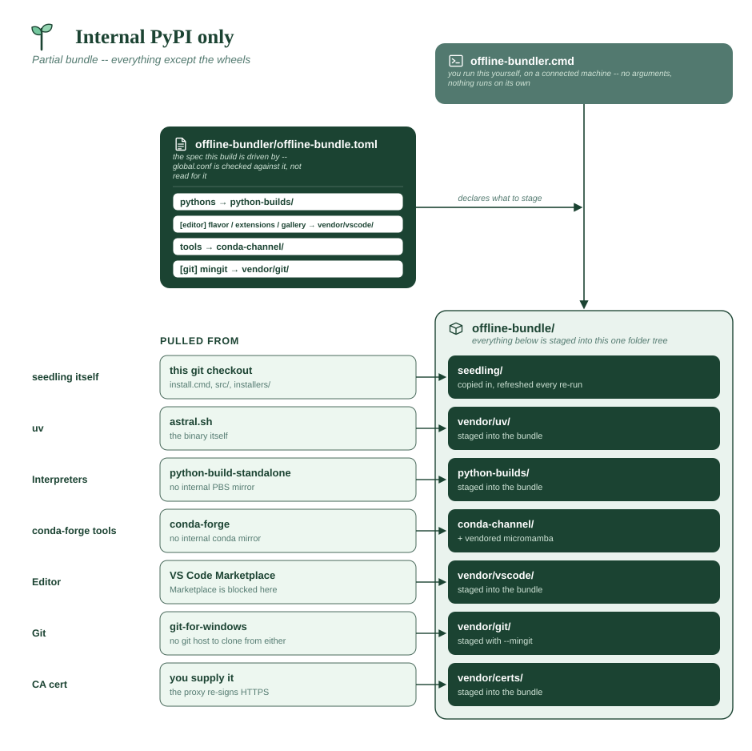
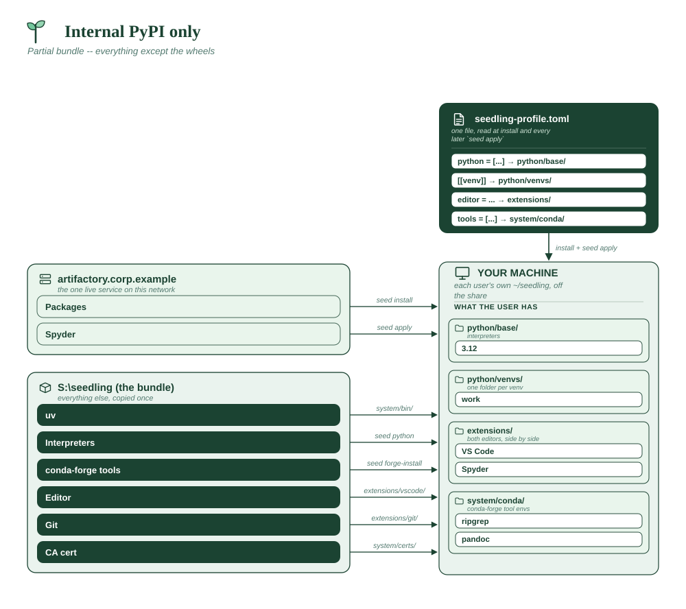

# Internal PyPI only

The awkward middle: IT runs an Artifactory that proxies **PyPI and only
PyPI**. No conda-forge mirror, no python-build-standalone mirror, no Marketplace,
and a proxy that re-signs HTTPS on the way through.

This is a **partial bundle**, and it is the case that shows seedling's offline
pieces are independent of each other. Each source is configured separately, so
you point the one you have at a URL and bundle the three you don't:

| Needs | Comes from |
|---|---|
| Python packages | 🌐 the internal PyPI, over HTTPS — optionally *stocked* from the bundle's `wheels/` |
| Interpreters | 📦 bundled `python-builds/` |
| conda-forge tools | 📦 bundled `conda-channel/` |
| VS Code | 📦 bundled `vendor/vscode/` |
| **Spyder** | 🌐 the internal PyPI — it *is* a Python package |
| CA certificate | ✋ you supply it, in `vendor/certs/` |

**Assumes**

| Needs | ? | Detail |
|---|:-:|---|
| Internet on the machines | ❌ | no public internet; one live internal service |
| Internal package index | ✅ | **the only thing reachable** -- Artifactory proxying PyPI |
| Official VS Code + Marketplace | ❌ | Marketplace blocked, so VS Code is **bundled** instead |
| Spyder (from PyPI) | ✅ | installs from the internal PyPI -- no bundling needed |
| conda-forge tools | ✅ | no conda-forge mirror, so a **bundled** conda channel |
| Corporate CA certificate | ✅ | **required** -- the proxy re-signs HTTPS |
| Bundled git (MinGit) | ✅ | `--mingit`; no git host to clone from either |
| A reachable git host | ❌ | no `[[repo]]` entries |
| Multi-user share root | ❌ | per-user installs from the share |
| Offline bundle to build | ⚠️ | **partial** -- the wheels are optional, and useful mainly as the set you *publish* to the internal index |
| **x86_64 only** | ✅ | the Spyder half pins the whole profile to x86_64 |





```toml
# profile.toml -- the standard environment.

python = ["3.12"]

# No conda-forge mirror here, so these come from the bundled channel.
tools = ["ripgrep", "pandoc"]

# Two editors, sourced two different ways: VS Code is pre-seeded into the
# bundle because the Marketplace is unreachable, while Spyder installs from
# the internal PyPI like any other package. Neither needs the internet.
editor = ["vscode", "spyder"]

[[venv]]
name = "work"
packages = ["pandas", "numpy", "requests", "pytest"]
default = true
```

The conf is where this shape becomes visible — **a URL and directory paths
side by side**:

```sh
# global.conf -- in the copy on the share.

# Install seedling itself from the share: no git, no network.
SEEDLING_REPO_URL="S:\seedling\seedling"

# The one live service: a URL, so uv treats it as an index and resolves
# against it normally. Spyder arrives through here.
SEEDLING_PACKAGE_INDEX="https://artifactory.corp.example/api/pypi/pypi/simple"

# The two that aren't mirrored: directories in the bundle, so uv reads them
# as local sources with the internet disabled.
SEEDLING_PYTHON_MIRROR="S:\seedling\python-builds"
SEEDLING_CONDA_CHANNEL="S:\seedling\conda-channel"

# The proxy re-signs HTTPS and IT has NOT pushed the root machine-wide, so
# ship the PEM in vendor/certs/ and leave native_tls off.
SEEDLING_NATIVE_TLS="false"

SEEDLING_PROFILE="profile.toml"
```

**What the share holds.** Even here the bundle declares its own contents —
and on this network that list has a second job, below:

```toml
# offline-bundle.toml -- next to global.conf.

pythons = ["3.12"]

# Every distribution the fleet needs. On this network these can either be
# left to the proxy, or built here and PUBLISHED into the internal index --
# see "Two ways to feed the index" below. `spyder` is listed because it's an
# ordinary PyPI application, editor or not.
packages = [
    "pandas", "numpy", "requests", "pytest", "spyder", "httpx", "openpyxl",
]

tools = ["ripgrep", "pandoc"]

[editor]
flavor = "microsoft"

[git]
mingit = true
```

**Building it:**

```
build-offline.cmd --check-profile profile.toml ^
                  --deploy-root "S:\seedling" ^
                  --accept-third-party-terms
```

**Two ways to feed the index.** The wheel step is the one that's optional
here, and which way you go decides what `package_index` points at:

1. **Let the proxy serve them.** `build-offline` is a walkthrough, so run it
   *without* `--yes` and answer **no** at "Download the wheels now?", then
   yes to the rest. `package_index` stays the Artifactory URL. Simplest, and
   right when the proxy really does reach everything your profiles name.
2. **Build the wheels and upload them into the internal index.** Answer
   **yes**, and `wheels/` becomes exactly the set of distributions your
   fleet needs — resolved with their full dependency closures, once per
   mirrored interpreter — ready to publish into a *hosted* repository
   alongside the proxy:

   ```sh
   seed config set package_upload_url https://artifactory.corp.example/api/pypi/pypi-local/
   seed config set package_upload_token <a token with write access>
   seed upload-whls S:\seedling\wheels
   ```

   [`seed upload-whls`](../commands/offline-utilities.md) runs `uvx twine
   upload` for you, honors the `ca_cert` this network needs, and passes the
   token through the environment rather than a command line. Set the token
   **only on this publishing machine**: leaving
   `SEEDLING_PACKAGE_UPLOAD_TOKEN` empty in the conf you distribute is what
   keeps write access off every user's machine.

   `package_index` still points at the index URL -- the
   bundle was the *source* of what you published, not the runtime source.
   This is the option to take when the proxy is allowlisted, when it can't
   reach a package you need, or when you want the exact resolved set pinned
   in your own repository rather than whatever the proxy resolves later.

   `--check-profile` is doing real work in this flow: it verifies the wheel
   set covers every profile *before* you publish it, so a missing package is
   caught on the build machine rather than by the first user whose
   `seed apply` can't resolve.

Either way, staging the wheels is harmless — it also gives you a fallback if
the mirror goes down, though using it as the fallback means pointing
`package_index` at `S:\seedling\wheels` instead of the URL, since only one of
the two can be the package source at a time.

**Why it's shaped this way**

- **A URL and a directory in the same conf is normal**, not a workaround.
  seedling resolves each source independently: `package_index` as a URL
  becomes uv's default index, while `python_mirror` and `conda_channel` as
  directories become local sources. Nothing requires them to agree.
- **Spyder needs no bundling** on this network, which is the quiet advantage
  of an editor that ships as a Python package. VS Code has to be pre-seeded
  because its download endpoint and its Marketplace are both external
  services; Spyder just resolves from the index you already have.
- **`--accept-third-party-terms` is still required**, because the bundle
  contains the official VS Code and its Marketplace extensions even though
  the packages come from your mirror. What you are acknowledging is the
  *staging on the share*, not where the wheels came from.
- **The CA is the piece nobody can build for you.** A TLS-inspecting proxy is
  precisely what makes the internal PyPI URL work; without the root in
  `vendor/certs/`, every HTTPS call — uv's index requests included — fails
  certificate verification, and the symptom looks like a broken mirror rather
  than a missing certificate.

**Check it on the first machine**, since this shape has two independent ways
to fail — the URL and the bundled directories:

```
seed health-check
```

It verifies the CA bundle exists and parses, that the mirror directories are
present, and that the index is reachable.

---

**What the bundle looks like**

Note what is *absent*: no `wheels/`, because the internal PyPI serves those.

```
offline-bundle/                    -> copied to S:\seedling
├── MANIFEST.json
├── seedling/                      users run install.cmd from here
│   ├── global.conf              the mixed URL + directory conf above
│   ├── profile.toml
│   └── vendor/
│       ├── uv/
│       │   ├── uv.exe
│       │   └── uvx.exe
│       ├── vscode/                official VS Code -- the Marketplace is
│       │   └── app/               unreachable, so it is pre-seeded
│       │       ├── Code.exe
│       │       ├── bin/code.cmd
│       │       └── data/          settings + extensions
│       ├── micromamba/
│       │   └── micromamba.exe
│       ├── git/                   MinGit, from --mingit
│       │   └── cmd/git.exe
│       └── certs/                 <- YOU fill this one
│           └── corp-root-ca.pem
├── python-builds/                 no PBS mirror internally, so bundled
│   └── 20250115/
│       └── cpython-3.12.8+2025...-x86_64-pc-windows-msvc-install_only.tar.gz
├── conda-channel/                 no conda-forge mirror internally, so bundled
│   ├── noarch/repodata.json
│   └── win-64/
│       ├── repodata.json
│       ├── ripgrep-14.1.1-h.....conda
│       └── pandoc-3.5-h.....conda
└── (no wheels/ -- SEEDLING_PACKAGE_INDEX is the Artifactory URL)
```

Spyder is the interesting absence too: it never appears in the bundle,
because `seed apply` installs it from the internal index at provisioning
time, the same way it installs `pandas`.

Where each lands on the target:

| Bundle folder | Installed to |
|---|---|
| `vendor/uv/` | `system/bin/` |
| `vendor/micromamba/` | `system/bin/` |
| `vendor/vscode/` | `extensions/vscode/` |
| `vendor/git/` | `extensions/git/` |
| `vendor/certs/` | concatenated into `system/certs/ca-bundle.pem` |

**What a cert file looks like.** Any PEM-encoded certificate, one or more per
file. The installer concatenates *every* `.pem` and `.crt` in the folder into
`~/seedling/system/certs/ca-bundle.pem`, so a root and an intermediate can be
separate files:

```
vendor/certs/
├── corp-root-ca.pem
└── corp-issuing-ca.pem
```

```
-----BEGIN CERTIFICATE-----
MIIDdzCCAl+gAwIBAgIEAgAAuTANBgkqhkiG9w0BAQUFADBaMQswCQYDVQQGEwJJ
... base64, usually 20-30 lines ...
c2VkbGluZyBleGFtcGxlIC0tIG5vdCBhIHJlYWwgY2VydGlmaWNhdGU=
-----END CERTIFICATE-----
```

Export it from your browser or from IT as **Base-64 encoded X.509**, not DER.
A DER file (binary, often `.cer`) gets concatenated as bytes and quietly
breaks the bundle — if HTTPS fails after install, check this first. The bundle
is rebuilt on every install, so rotating a certificate is a re-run rather than
a manual edit.
