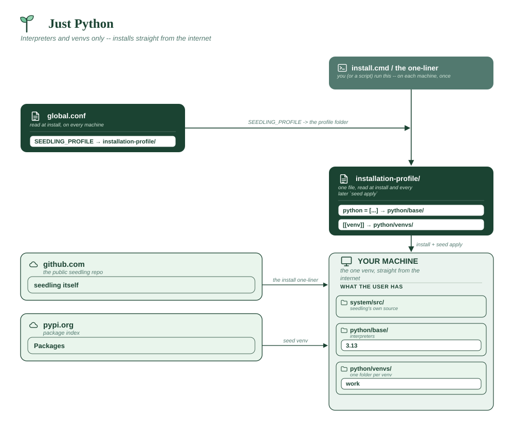

# Just Python

No editor, no repos. For people who already have their own setup and want
seedling only for interpreters and environments.

**Assumes**

| Needs | ? | Detail |
|---|:-:|---|
| Internet on the machines | ✅ | reaches PyPI |
| Internal package index | ❌ | public PyPI |
| Official VS Code + Marketplace | ❌ | you bring your own editor |
| Spyder (from PyPI) | ❌ | you bring your own editor |
| conda-forge tools | ❌ | none |
| Corporate CA certificate | ❌ | default trust store |
| Bundled git (MinGit) | ❌ | not needed |
| A reachable git host | ❌ | no `[[repo]]` entries |
| Multi-user share root | ❌ | per-user installs |
| Offline bundle to build | ❌ | installs straight from the internet |
| **x86_64 only** | ❌ | no editor, so no Qt constraint |



```toml
# profile.toml

python = ["3.13"]

[[venv]]
name = "work"
packages = ["ipython", "requests"]
default = true
```

Omitting `editor` means `seed apply` installs none. Whether the installer
sets up VS Code is then `SEEDLING_AUTO_VSCODE`'s decision in `global.conf`
— set it to `"false"` for a genuinely editor-free install.

Point your own editor at the environment with the interpreter path:

```
seed which work
```

**Vendor folder:** none.
