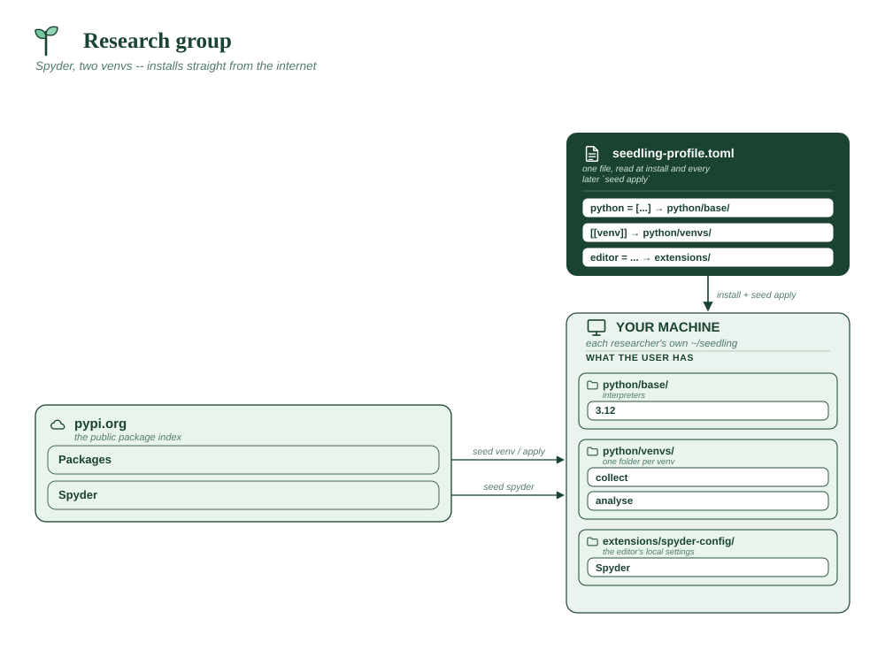

# Research group

Scientists who work in Spyder and want their data collection kept apart from
their analysis. Two environments, because instrument drivers and analysis
libraries have a habit of disagreeing about versions — and when they do, you
want the collection rig to keep working.

**Assumes**

| Needs | ? | Detail |
|---|:-:|---|
| Internet on the machines | ✅ | every machine reaches PyPI |
| Internal package index | ❌ | public PyPI; set `package_index` for an internal mirror |
| Official VS Code + Marketplace | ❌ | no Microsoft account or Marketplace access needed |
| Spyder (from PyPI) | ✅ | the editor for this deployment |
| conda-forge tools | ❌ | nothing outside PyPI |
| Corporate CA certificate | ❌ | default trust store |
| Bundled git (MinGit) | ❌ | Windows bootstraps it if `seed repo-clone` is used |
| A reachable git host | ❌ | no `[[repo]]` entries |
| Multi-user share root | ❌ | each person installs to their own `~/seedling` |
| Offline bundle to build | ❌ | installs straight from the internet |
| **x86_64 only** | ✅ | Spyder's Qt wheels are x86_64-only |



```toml
# profile.toml -- environment for the lab.

python = ["3.12"]

# Spyder only. No VS Code: this also switches off the installer's VS Code
# setup, so nobody waits on a ~300 MB download they'll never open.
editor = "spyder"

# Collecting: talks to instruments. Deliberately lean -- the fewer libraries
# in here, the fewer things that can break a run that's already underway.
[[venv]]
name = "collect"
packages = ["pyserial", "pyvisa", "pandas"]

# Analysing: the heavy stack. This is the one people are in most of the day,
# so it's the default -- new terminals land here, and `seed spyder` opens
# against it.
[[venv]]
name = "analyse"
packages = ["pandas", "numpy", "scipy", "matplotlib", "seaborn",
            "jupyterlab", "openpyxl"]
default = true
```

**Why it's shaped this way**

- `default = true` on `analyse` sets what new terminals activate. Spyder
  follows the *activated* venv, so `seed activate collect && seed spyder`
  opens against the rig instead — the switch is one command, no
  reconfiguration.
- Spyder's console needs a matching `spyder-kernels` in whichever venv it
  runs code in. `seed spyder` installs it for you; you don't list it here.
- `openpyxl` because someone always has an `.xlsx`.

> **Spyder is x86_64 only** — its Qt dependency publishes no arm64 wheels. On
> Apple Silicon or ARM Linux, drop the `editor` line and use
> `tools = ["spyder"]` instead, which installs the conda-forge build.

**Vendor folder:** none — nothing is bundled, so there is no `vendor/` at all.
Everything downloads on demand from PyPI.
