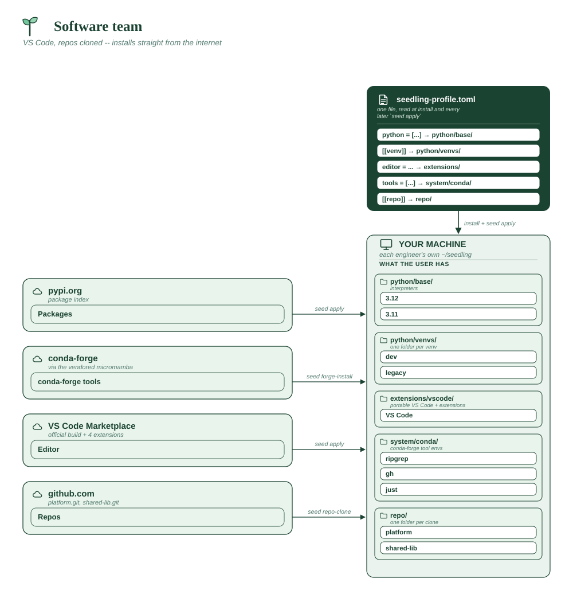

# Software team

Engineers who live in VS Code, on a codebase that's already in git. The repos
are cloned *and* their dependencies installed, so a new hire's first command
is the one that does actual work.

**Assumes**

| Needs | ? | Detail |
|---|:-:|---|
| Internet on the machines | ✅ | PyPI, the Marketplace and your git host |
| Internal package index | ⚠️ | swap in Artifactory/Nexus via `package_index` if you have one |
| Official VS Code + Marketplace | ✅ | the official build, with Pylance |
| Spyder (from PyPI) | ❌ | VS Code only |
| conda-forge tools | ✅ | `ripgrep`, `gh`, `just` from conda-forge |
| Corporate CA certificate | ❌ | default trust store |
| Bundled git (MinGit) | ❌ | system git on macOS/Linux; Windows bootstraps it |
| A reachable git host | ✅ | two `[[repo]]` entries clone from GitHub |
| Multi-user share root | ❌ | per-user installs |
| Offline bundle to build | ❌ | installs straight from the internet |
| **x86_64 only** | ❌ | VS Code runs on arm64 too |



```toml
# seedling-profile.toml -- the platform team's standard environment.

python = ["3.12", "3.11"]

# Command-line tools that aren't Python packages, so `seed install` can't
# provide them.
tools = ["ripgrep", "gh", "just"]

editor = "vscode"

[[venv]]
name = "dev"
python = "312"
packages = ["pytest", "pytest-cov", "mypy", "ruff", "ipython"]
default = true

# Kept on 3.11 because the legacy service hasn't moved yet. Both interpreters
# are listed above, so this resolves without anyone installing one by hand.
[[venv]]
name = "legacy"
python = "311"
packages = ["pytest", "requests"]

[[repo]]
url = "https://github.com/acme/platform.git"
install = "dev"         # editable install into the dev venv

# The shared library is developed against from both environments, so it's
# named for both rather than left to whichever venv happens to be the default.
# Its test extra is wanted on 3.12 only -- extras attach to the venv they're
# for, so one clone lands differently in each.
[[repo]]
url = "https://github.com/acme/shared-lib.git"
install = ["dev[test]", "legacy"]

[config]
vscode_extensions = [
    "ms-python.python",
    "ms-python.vscode-pylance",
    "charliermarsh.ruff",
    "eamodio.gitlens",
]
```

**Why it's shaped this way**

- `python = ["3.12", "3.11"]` first, then each venv names its base with
  `python = "312"` / `"311"`. A venv can only build from an interpreter the
  profile installs.
- `install` names the venvs to run the equivalent of `seed repo-install` in
  after cloning — an editable install when the repo has a `pyproject.toml`,
  otherwise its `requirements.txt`. One name or a list; rebuild one of those
  venvs later and `seed apply` installs the repo into it again.
- `vscode_extensions` **replaces** the built-in starter kit rather than adding
  to it, so list everything you want, including the Python extension.

**Team shortcuts, as [custom commands](../CUSTOM-COMMANDS.md).** `ruff` and
`pytest` are already in `dev`'s packages above — declaring `seed lint` and
`seed test` as one-line wrappers means a new hire's first commands work
without them ever discovering the underlying tool names:

```toml
# custom-commands.toml -- next to seedling-profile.toml in the distributed copy
[[command]]
name = "lint"
run = ["ruff", "check", "."]
venv = "dev"
description = "Lint the current project"

[[command]]
name = "test"
run = ["pytest", "-q"]
venv = "dev"
description = "Run the test suite"
```

Wired in `seedling.conf` next to `SEEDLING_PROFILE`:

```sh
SEEDLING_CUSTOM_COMMANDS="custom-commands.toml"
```

`venv = "dev"` pins both to the `dev` venv regardless of what's active in the
caller's shell — the same reasoning `[[repo]] install` names venvs explicitly
rather than trusting whatever happens to be the default.

**Vendor folder:** none. Everything downloads on demand.
